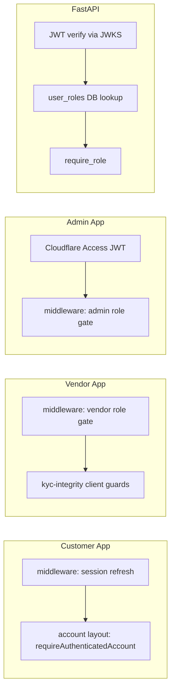

# Authentication & Permissions Matrix

---

## Authentication provider

| Layer       | Technology                                 | Source                                    |
| ----------- | ------------------------------------------ | ----------------------------------------- |
| Identity    | **Supabase Auth**                          | Phone OTP, email/password, Google OAuth   |
| Session     | `@supabase/ssr` cookies                    | `packages/auth/src/middleware.ts`         |
| API tokens  | Supabase JWT (RS256/ES256 via JWKS)        | `services/api/app/core/auth.py`           |
| Admin edge  | **Cloudflare Access**                      | `apps/admin/lib/cf-access.ts`             |
| Role claims | JWT `app_metadata.roles` + DB `user_roles` | Migration `0051` custom access token hook |

---

## Session handling

| App          | Middleware behaviour               | Route protection                                      |
| ------------ | ---------------------------------- | ----------------------------------------------------- |
| **Customer** | Session refresh only               | Layout/page guards (`account/layout.tsx`, `/welcome`) |
| **Vendor**   | Session + `vendor` role redirect   | Middleware + KYC client guards                        |
| **Admin**    | CF Access + session + `admin` role | Middleware + API 403 UX                               |
| **API**      | Bearer JWT per request             | `get_current_user`, `require_role()`                  |

**Gap:** Customer middleware does **not** redirect unauthenticated users — account protection is layout-only (R-010).

---

## Permissions matrix (major roles)

Legend: ✅ Allow | ❌ Deny | 🔒 API+RLS | ⚠️ Partial

| Capability            | Anonymous | Customer | Vendor applicant   | Approved vendor | Admin    |
| --------------------- | --------- | -------- | ------------------ | --------------- | -------- |
| Browse catalog/search | ✅        | ✅       | ✅                 | ✅              | ✅       |
| Guest cart            | ✅        | ✅       | —                  | —               | —        |
| Checkout / pay        | ❌        | 🔒       | ❌                 | ❌              | ❌       |
| Account / orders      | ❌        | 🔒       | ❌                 | ❌              | 🔒       |
| Vendor onboarding     | ❌        | ✅*      | 🔒                 | —               | —        |
| Vendor dashboard      | ❌        | ❌       | ⚠️ onboarding only | 🔒              | ❌       |
| Manage listings       | ❌        | ❌       | ❌                 | 🔒              | 🔒       |
| KYC submit            | ❌        | ❌       | 🔒                 | 🔒              | —        |
| KYC approve           | ❌        | ❌       | ❌                 | ❌              | 🔒       |
| Admin config          | ❌        | ❌       | ❌                 | ❌              | 🔒       |
| Internal cron         | ❌        | ❌       | ❌                 | ❌              | 🔒 token |
| Service-role DB       | ❌        | ❌       | ❌                 | ❌              | API only |

\*Customer can access vendor onboarding before vendor role assigned.

### Extended roles (not separately implemented in UI)

| Role                | Status                                    |
| ------------------- | ----------------------------------------- |
| Suspended vendor    | API/DB state machine — no distinct UI     |
| Support officer     | **NOT_IMPLEMENTED** — uses admin          |
| Finance officer     | **NOT_IMPLEMENTED**                       |
| KYC reviewer        | **NOT_IMPLEMENTED** — uses admin          |
| Super administrator | **NOT_IMPLEMENTED** — single `admin` role |

---

## Database RLS vs API authz

| Layer        | Enforces                                | Test coverage                                 |
| ------------ | --------------------------------------- | --------------------------------------------- |
| **RLS**      | Row ownership, role-based SELECT/INSERT | `tests/rls/test_matrix.py`, `supabase/tests/` |
| **API**      | Authentication + role guards            | `test_authz_matrix.py` (227 routes)           |
| **Triggers** | State machines, immutability            | `0056`, `0057`, money gates                   |

**Principle:** API uses service-role client; RLS is defense-in-depth for direct Supabase client access from browsers.

---

## KYC-dependent access

| Tier / state         | Vendor capability                                |
| -------------------- | ------------------------------------------------ |
| No KYC record        | Onboarding only                                  |
| Draft / submitted    | Limited — listing caps via `require_listing_cap` |
| Approved (auditable) | Full wholesale, listing publish                  |
| Suspended / revoked  | API 403; client `kyc-integrity.ts` guards        |

Client guard: `isAuditableApproved()` — never trust bare `kyc_tier` without record.

---

## Permission-denied handling

| App      | Pattern                                      |
| -------- | -------------------------------------------- |
| Vendor   | `vendor-errors.ts` → i18n `permissionDenied` |
| Admin    | `AdminLoadFailure.tsx` warning panel         |
| Customer | Redirect to login (account layout)           |
| API      | 401 missing/invalid token; 403 wrong role    |

---

## Cross-application login

- **Shared Supabase project** — same user can be customer + vendor + admin (via `user_roles`)
- **Separate origins** — `www`, `vendor`, `admin` subdomains; cookies scoped per origin
- **No SSO bridge** — each app has own login page

---

## Security findings

| ID    | Severity | Finding                                                              |
| ----- | -------- | -------------------------------------------------------------------- |
| R-010 | P2       | Customer auth only in layout, not middleware                         |
| R-011 | P2       | JWT `app_metadata.roles` used in middleware (fast path); API uses DB |
| R-012 | P2       | Anon EXECUTE on SECURITY DEFINER RPCs (Supabase advisor)             |
| R-013 | P3       | Leaked password protection disabled                                  |
| R-014 | INFO     | Admin CF Access properly gates production                            |

---

## Auth flow diagram

