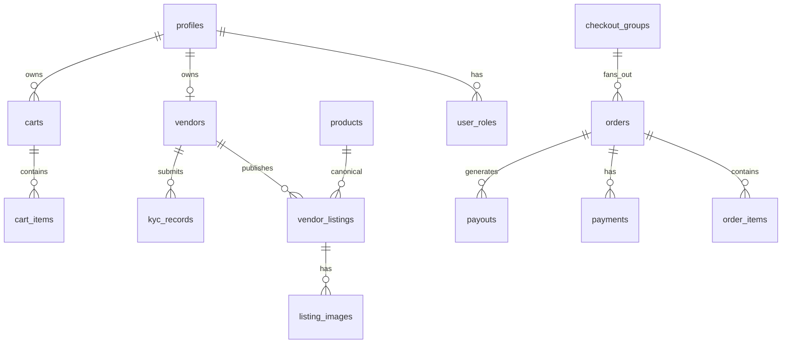

# Database Schema & RLS Audit

**Project:** Vergeo5 (`dpadrlxukcjbewpqympu`)  
**Region:** eu-north-1  
**Engine:** PostgreSQL 17.6  
**Status:** ACTIVE_HEALTHY

---

## Schema overview

| Schema    | Objects          | Notes                       |
| --------- | ---------------- | --------------------------- |
| `public`  | 72 tables        | All RLS enabled             |
| `storage` | buckets, objects | KYC private + public assets |

### Extensions (public schema — advisor WARN)

- `pg_trgm`, `vector` — linter recommends moving out of `public`

---

## Migration status

| Source                                | Count | Latest                            |
| ------------------------------------- | ----- | --------------------------------- |
| **Repository** `supabase/migrations/` | 70    | `0070_vendor_commercial_tier.sql` |
| **Production** (Supabase MCP)         | 71    | `0071_vendor_listing_compare_at`  |

### Drift

- **`0071_vendor_listing_compare_at`** applied in production, **absent from repo** (R-003)
- Likely adds `compare_at_ngwee` on `vendor_listings` for struck-through pricing
- Timestamp-style migration names (`20260717100303`) interleaved with sequential `00xx` — ordering OK in prod

---

## Table inventory (production row counts)

| Table              | Rows | Purpose                  | RLS                     |
| ------------------ | ---- | ------------------------ | ----------------------- |
| `products`         | 150  | Canonical catalog        | Public active read      |
| `vendor_listings`  | 134  | Vendor offers            | Owner + public active   |
| `listing_images`   | 134  | Listing media            | Owner + public          |
| `categories`       | 74   | Category tree            | Public read             |
| `search_documents` | 288  | Unified search index     | Trigger-maintained      |
| `embedding_jobs`   | 288  | Embedding queue          | Service only            |
| `vendors`          | 3    | Vendor accounts          | Owner + public active   |
| `profiles`         | 4    | User profiles            | Owner                   |
| `user_roles`       | 6    | Role assignments         | Hook-readable           |
| `carts`            | 5    | Active carts             | Owner/guest             |
| `cart_items`       | 0    | Cart lines               | —                       |
| `orders`           | 0    | **No production orders** | Customer/vendor scoped  |
| `payments`         | 0    | No payments yet          | —                       |
| `payouts`          | 0    | No payouts yet           | —                       |
| `kyc_records`      | 0    | No KYC submissions       | Owner read, admin write |
| `events`           | 0    | No live events           | —                       |
| `jobs`             | 0    | No RFQ jobs              | —                       |
| `search_query_log` | 81   | Search analytics         | Admin read              |
| `platform_config`  | 17   | Runtime config           | Auth read               |
| `feature_flags`    | 5    | Feature toggles          | Public read             |
| `merch_slots`      | 2    | Homepage hero            | Public read             |
| `commission_rates` | 9    | Fee schedule             | Public read             |
| `delivery_zones`   | 3    | Lusaka delivery          | Public read             |
| `synonyms`         | 10   | Bemba/Nyanja search      | Public read             |
| `config_audit`     | 11   | Config change log        | Admin                   |
| `analytics_events` | 1    | Client analytics         | Admin read              |

### Service-role only tables (RLS, zero client policies — intentional)

`audit_log`, `notification_outbox`, `ledger_accounts`, `ledger_transactions`, `ledger_postings`, `stock_reservations`, `rate_counters`, `webhook_events`, `invoice_counters`, `order_money_gates`

Supabase advisor flags these as "RLS enabled no policy" — **by design** (service_role only).

---

## Key relationships

---

## RLS policy patterns

| Pattern                  | Tables                                  | Mechanism                  |
| ------------------------ | --------------------------------------- | -------------------------- |
| Owner CRUD               | `profiles`, `addresses`, `carts`        | `auth.uid() = user_id`     |
| Vendor owner             | `vendor_listings`, `services`, `events` | Join via `vendors.user_id` |
| Public read (published)  | `products`, `search_documents`          | `status = 'active'`        |
| Admin override           | Most tables                             | `has_role('admin')`        |
| Customer order isolation | `orders`                                | `customer_id = auth.uid()` |
| FORCE RLS                | Launch tables (`0064`)                  | Even table owner blocked   |

### Hardening migrations (selected)

| Migration                                   | Purpose                            |
| ------------------------------------------- | ---------------------------------- |
| `0056_kyc_integrity`                        | KYC decision immutability trigger  |
| `0057`/`0058`                               | Client guards — no self-activation |
| `0059_order_money_gates`                    | Exclusive escrow drain             |
| `0062_payments_checkout_success_uniq`       | Idempotent payment success         |
| `0064_force_rls_launch_tables`              | FORCE RLS on ticket/event tables   |
| `0069_orders_commission_snapshot_immutable` | Commission snapshot lock           |

---

## Storage buckets

| Bucket                         | RLS     | Purpose                    |
| ------------------------------ | ------- | -------------------------- |
| 2 buckets in `storage.buckets` | Enabled | KYC docs (private), assets |

---

## Security advisor findings

| Lint                                        | Level | Detail                                                                |
| ------------------------------------------- | ----- | --------------------------------------------------------------------- |
| `rls_enabled_no_policy`                     | INFO  | Service-role-only tables (expected)                                   |
| `extension_in_public`                       | WARN  | `pg_trgm`, `vector`                                                   |
| `anon_security_definer_function_executable` | WARN  | `has_role`, `search_query_facets`, `guard_kyc_record_integrity`, etc. |
| `auth_leaked_password_protection`           | WARN  | Disabled in Supabase Auth                                             |

### RPC exposure (WARN)

Anonymous users can call some SECURITY DEFINER functions via PostgREST. Migration `0050_revoke_definer_execute_from_public` partially addresses; advisors still flag remaining grants.

---

## Data classification

| Data type             | Present in prod            | Classification             |
| --------------------- | -------------------------- | -------------------------- |
| Catalog/seed products | 150 products, 134 listings | Demo/seed — not real-money |
| User profiles         | 4                          | Likely team/test           |
| Orders/payments       | 0                          | No transactional data      |
| Search logs           | 81                         | Anonymized analytics       |

---

## pgTAP test coverage

15 files in `supabase/tests/` covering migrations `0002`–`0012`, `0034`, `0039`, `0056`, seed.

**Gap:** No pgTAP for `0013`–`0070` except spot checks.

---

## Recommendations

1. Pull `0071` migration into repo immediately (R-003)
2. Revoke anon EXECUTE on remaining SECURITY DEFINER RPCs
3. Enable leaked password protection in Supabase Auth
4. Add pgTAP for money triggers (`0062`, `0069`, `0059`)
