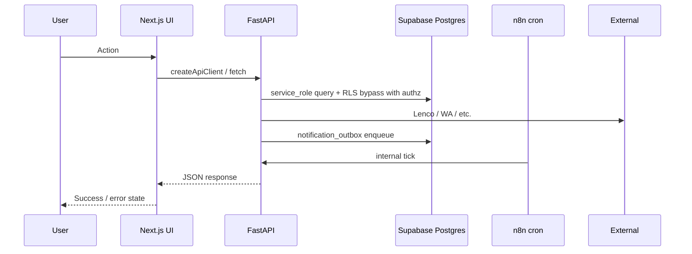

# Frontend-to-Backend Integration Map

Maps major user flows across UI → API → service → database → automation.

---

## Flow legend

---

## Customer flows

### Registration & login

| Step       | Layer      | Detail                                                               |
| ---------- | ---------- | -------------------------------------------------------------------- |
| 1          | UI         | `/[locale]/login` → `phone-form.tsx` / `google-button.tsx`           |
| 2          | Auth       | Supabase `signInWithOtp` / OAuth (not FastAPI)                       |
| 3          | Middleware | `updateSession()` refreshes cookies — **no route redirect**          |
| 4          | Post-login | `/welcome` checks onboarding; `/account` layout enforces auth        |
| 5          | DB         | `profiles` bootstrap trigger (`0010`); `user_roles` customer default |
| **Status** |            | **Working** (Supabase path)                                          |

### Product discovery

| Step       | Layer     | Detail                                            |
| ---------- | --------- | ------------------------------------------------- |
| 1          | UI        | Homepage `/en` → `home-default.tsx`, merch slots  |
| 2          | API       | `GET /merch/slots`                                |
| 3          | DB        | `merch_slots` (public read)                       |
| 4          | Search    | `GET /search` → `search_documents` FTS + pgvector |
| 5          | Analytics | `search_query_log` insert                         |
| **Status** |           | **Working**; search images **partial** (R-002)    |

### Add to cart

| Step       | Layer | Detail                                                          |
| ---------- | ----- | --------------------------------------------------------------- |
| 1          | UI    | PDP `buy-box.tsx` / PLP quick-add                               |
| 2          | API   | `POST /cart/items` (guest cookie or JWT)                        |
| 3          | DB    | `carts`, `cart_items`; price snapshotted server-side            |
| 4          | SW    | Serwist **NetworkOnly** for `/cart` routes                      |
| **Status** |       | **Broken on cart page** — client calls `localhost:8000` (R-001) |

### Checkout & payment (MoMo)

| Step       | Layer   | Detail                                                        |
| ---------- | ------- | ------------------------------------------------------------- |
| 1          | UI      | `/checkout` steps: contact → fulfilment → payment             |
| 2          | API     | `POST /checkout/session`, step endpoints, `POST /orders`      |
| 3          | DB      | `checkout_groups`, `orders`, `stock_reservations`, `payments` |
| 4          | Payment | `POST /checkout/steps/payment` → Lenco USSD push              |
| 5          | Webhook | `POST /webhooks/lenco` → idempotent settlement                |
| 6          | N8N     | Payment sweeper, reconciliation poll (1m/30m)                 |
| 7          | Notify  | `notification_outbox` → dispatch tick (1m) → WhatsApp         |
| **Status** |         | Code complete; **BLOCKED_UNSAFE** to verify real money        |

### Order tracking

| Step       | Layer   | Detail                                          |
| ---------- | ------- | ----------------------------------------------- |
| 1          | UI      | `/account/orders/[id]`                          |
| 2          | API     | `GET /account/orders/{id}`                      |
| 3          | DB      | `orders`, `order_events`, `order_item_products` |
| 4          | Actions | Confirm received, dispute, return, review       |
| **Status** |         | **Working** (no production orders in DB)        |

---

## Vendor flows

### Vendor registration & KYC

| Step       | Layer   | Detail                                                        |
| ---------- | ------- | ------------------------------------------------------------- |
| 1          | UI      | Customer `/sell` → vendor app `/onboarding`                   |
| 2          | Auth    | Middleware allows onboarding without `vendor` role            |
| 3          | API     | `POST /kyc/bootstrap`, `PATCH /kyc/draft`, `POST /kyc/submit` |
| 4          | Storage | `POST /media/kyc-doc/sign` → Supabase private bucket          |
| 5          | DB      | `kyc_records`, `vendors`; integrity trigger `0056`            |
| 6          | N8N     | KYC-stalled nudge (6h) via `/internal/n8n/kyc-stalled/tick`   |
| **Status** |         | **Working** (code); 0 KYC records in prod DB                  |

### Vendor approval (admin)

| Step       | Layer  | Detail                               |
| ---------- | ------ | ------------------------------------ |
| 1          | UI     | Admin `/kyc/[id]` → DecisionPanel    |
| 2          | API    | `POST /admin/kyc/{id}/approve` etc.  |
| 3          | DB     | State machine + `audit_log`          |
| 4          | Notify | Outbox → vendor WhatsApp             |
| **Status** |        | **BLOCKED_UNSAFE** for live approval |

### Listing publication

| Step       | Layer | Detail                                                       |
| ---------- | ----- | ------------------------------------------------------------ |
| 1          | UI    | `/listings/new` → `listing-create-flow.tsx`                  |
| 2          | API   | `POST /vendor/listings`, images, stock                       |
| 3          | DB    | `vendor_listings`, `listing_images`, `search_documents` sync |
| 4          | N8N   | Embeddings tick (5m) → `embedding_jobs`                      |
| **Status** |       | **Working** — 134 listings in prod                           |

### Order fulfilment

| Step       | Layer  | Detail                                       |
| ---------- | ------ | -------------------------------------------- |
| 1          | UI     | `/orders/[id]` → action bar                  |
| 2          | API    | confirm → pack → ship / ready-for-pickup     |
| 3          | DB     | `orders` state machine, `order_events` audit |
| 4          | Pickup | `POST /vendor/pickup/verify` (QR or PIN)     |
| 5          | N8N    | Auto-confirm/release jobs                    |
| **Status** |        | **Working** (code); 0 orders in prod         |

### Escrow & payout

| Step       | Layer   | Detail                                               |
| ---------- | ------- | ---------------------------------------------------- |
| 1          | Capture | Lenco webhook → `payments` settled → ledger postings |
| 2          | Hold    | Escrow in ledger accounts                            |
| 3          | Release | `POST /internal/order-jobs/auto-release` (n8n)       |
| 4          | Gate    | `order_money_gates` exclusive drain                  |
| 5          | Payout  | `POST /internal/payouts/tick` → Lenco transfer       |
| 6          | UI      | Vendor `/payouts` (hidden from nav)                  |
| **Status** |         | **NOT_DEPLOYED** money path (0 payments/payouts)     |

---

## Admin flows

### KYC review, disputes, config

All follow: Admin UI → `createApiClient` + bearer → `/admin/*` → service_role + `require_role("admin")` → `audit_log`.

Production OpenAPI confirms **67 admin operations** mounted at `api.vergeo5.com`.

---

## Broken / missing links

| Gap                         | Evidence                                                |
| --------------------------- | ------------------------------------------------------- |
| Cart → API                  | Production calls `localhost:8000` not `api.vergeo5.com` |
| Customer auth in middleware | Account routes rely on layout-only guard                |
| Admin refunds               | No UI; API `POST /refunds/execute` exists               |
| COD collection              | API routes in `cod.py`; verify mount in prod OpenAPI    |
| n8n error handler           | Inactive — no workflow failure alerts                   |
| Migration 0071              | Prod schema ahead of repo — compare_at price field      |

---

## Events without consumers

| Event                        | Consumer                       |
| ---------------------------- | ------------------------------ |
| `notification_outbox` insert | ✅ dispatch tick (1m)          |
| `embedding_jobs` pending     | ✅ embeddings tick (5m)        |
| `webhook_events`             | ✅ reconciliation + sweeper    |
| `funnel_events` abandon      | ✅ funnel abandon tick         |
| Workflow failures            | ❌ shared error alert inactive |
