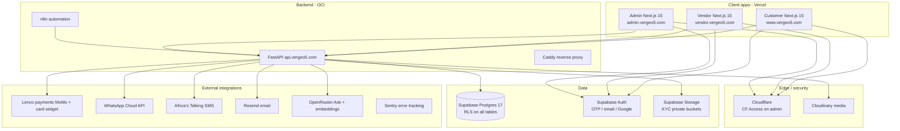

# Convergeo / Vergeo5 — Platform Architecture Overview

**Audit date:** 2026-07-24  
**Repository:** `Convergeo` (monorepo, brand: Vergeo5)  
**Auditor:** Cursor Cloud Agent (evidence-based; code + MCP + browser + production probes)

---

## Executive summary

Vergeo5 is a **mobile-first, multi-vendor commerce and discovery platform for Zambia**, implemented as a **pnpm/turborepo monorepo** with three Next.js 15 frontends, a FastAPI backend on OCI, Supabase Postgres 17, and n8n automation on `n8n.vergeo5.com`.

### Verified production state (2026-07-24)

| Surface      | URL                                           | Health                   | Evidence                                |
| ------------ | --------------------------------------------- | ------------------------ | --------------------------------------- |
| Customer web | https://www.vergeo5.com / https://vergeo5.com | **200** `GET /en/health` | Vercel project `convergeo-customer`     |
| Vendor web   | https://vendor.vergeo5.com                    | **307** → locale         | Vercel project `convergeo-vendor`       |
| Admin web    | https://admin.vergeo5.com                     | **302** CF Access        | Vercel project `convergeo-admin`        |
| API          | https://api.vergeo5.com                       | **200** `GET /healthz`   | OpenAPI: **256 paths / 287 operations** |
| Database     | Supabase `Vergeo5` (`dpadrlxukcjbewpqympu`)   | **ACTIVE_HEALTHY**       | eu-north-1                              |
| n8n          | `n8n.vergeo5.com` (MCP)                       | **7/9 workflows active** | Recent executions success               |

### Highest-risk findings (pre-remediation)

| ID    | Severity | Finding                                                                                                                                                   |
| ----- | -------- | --------------------------------------------------------------------------------------------------------------------------------------------------------- |
| R-001 | **P0**   | Customer **cart page fails in production** — browser requests `http://localhost:8000/cart` (misconfigured or missing `NEXT_PUBLIC_API_BASE_URL` at build) |
| R-002 | **P1**   | **Search product images** render as placeholders on production search                                                                                     |
| R-003 | **P1**   | **Migration drift** — production DB at `0071_vendor_listing_compare_at`; repo stops at `0070`                                                             |
| R-004 | **P1**   | **Vendor IA gap** — ~50% of vendor routes have no primary navigation link                                                                                 |
| R-005 | **P2**   | CSP report-only violations pollute console (GTM, Supabase, API origins)                                                                                   |
| R-006 | **P2**   | Supabase security advisors: anon-executable SECURITY DEFINER RPCs, leaked-password protection off                                                         |
| R-007 | **INFO** | Production API fully serves admin routes (401 without token); local route introspection under FastAPI 0.139+ differs from runtime                         |

---

## Platform diagram

---

## Applications inventory

### 1. Customer (`apps/customer`)

| Attribute             | Value                                                                      |
| --------------------- | -------------------------------------------------------------------------- |
| **Framework**         | Next.js 15 App Router, React 19, Tailwind 4, next-intl, Serwist PWA        |
| **Production domain** | https://www.vergeo5.com, https://vergeo5.com                               |
| **API base**          | `NEXT_PUBLIC_API_BASE_URL` → `https://api.vergeo5.com` (required at build) |
| **Auth**              | Supabase Auth (phone OTP, email, Google); session refresh in middleware    |
| **Roles**             | Anonymous, authenticated customer                                          |
| **Deployment**        | Vercel `convergeo-customer` (Node 24.x)                                    |
| **Page routes**       | **58** `page.tsx` files under `app/[locale]/`                              |
| **Locales**           | `en`, `bem`, `nya`, `fr`, `zh`                                             |

### 2. Vendor (`apps/vendor`)

| Attribute             | Value                                                            |
| --------------------- | ---------------------------------------------------------------- |
| **Framework**         | Next.js 15, shared `@vergeo/ui`, `@vergeo/auth`                  |
| **Production domain** | https://vendor.vergeo5.com                                       |
| **API base**          | `NEXT_PUBLIC_API_BASE_URL`                                       |
| **Auth**              | Supabase + middleware requires `vendor` role (onboarding exempt) |
| **Roles**             | Vendor applicant (onboarding), approved vendor                   |
| **Deployment**        | Vercel `convergeo-vendor`                                        |
| **Page routes**       | **31** pages                                                     |

### 3. Admin (`apps/admin`)

| Attribute             | Value                                                 |
| --------------------- | ----------------------------------------------------- |
| **Framework**         | Next.js 15                                            |
| **Production domain** | https://admin.vergeo5.com                             |
| **API base**          | `NEXT_PUBLIC_VERGEO_API_URL`                          |
| **Auth**              | Cloudflare Access (prod) + Supabase `admin` role      |
| **Dev bypass**        | `NEXT_PUBLIC_ADMIN_BYPASS=true` (non-production only) |
| **Deployment**        | Vercel `convergeo-admin`                              |
| **Page routes**       | **22** pages                                          |

### 4. API (`services/api`)

| Attribute          | Value                                                                |
| ------------------ | -------------------------------------------------------------------- |
| **Framework**      | FastAPI, Python 3.12, Pydantic v2, uv                                |
| **Production URL** | https://api.vergeo5.com                                              |
| **Auth**           | Supabase JWT (JWKS), `X-Internal-Token` for cron, webhook signatures |
| **Router modules** | **91** files; **227** route×method entries in authz matrix           |
| **Deployment**     | OCI Docker (GitHub `api-image.yml`); Caddy TLS                       |
| **Health**         | `/healthz`, `/readyz`, `/docs` (Swagger)                             |

### 5. Shared packages

| Package          | Path              | Purpose                             |
| ---------------- | ----------------- | ----------------------------------- |
| `@vergeo/ui`     | `packages/ui`     | Design system (113 components)      |
| `@vergeo/i18n`   | `packages/i18n`   | 17 namespaces × 5 locales           |
| `@vergeo/types`  | `packages/types`  | Generated DB types                  |
| `@vergeo/config` | `packages/config` | ESLint, Prettier, `createApiClient` |
| `@vergeo/auth`   | `packages/auth`   | Supabase session middleware         |

### 6. Database & migrations

| Attribute                 | Value                                                                |
| ------------------------- | -------------------------------------------------------------------- |
| **Provider**              | Supabase Postgres 17.6                                               |
| **Project**               | `dpadrlxukcjbewpqympu` (Vergeo5, eu-north-1)                         |
| **Tables (public)**       | **72** with RLS enabled                                              |
| **Repo migrations**       | **70** files (`0001`–`0070`)                                         |
| **Production migrations** | **71** (includes `0071_vendor_listing_compare_at` — **not in repo**) |
| **Seed data**             | 150 products, 134 listings, 74 categories, 3 vendors, 4 profiles     |

### 7. Automation (n8n)

| Workflow                     | ID                 | Active | Schedule                                           |
| ---------------------------- | ------------------ | ------ | -------------------------------------------------- |
| Payment reconciliation crons | `C1MpTNjrfLACMG3f` | ✅     | 1m / 10m / 30m / daily 02:00                       |
| Notification dispatch        | `sevKtX1AmimQCWsG` | ✅     | Every 1 min                                        |
| Reservation sweeper          | `F25zEWiPoIveARys` | ✅     | Every 2 min                                        |
| Embeddings cron              | `oqjfSdMXClfsf3qd` | ✅     | Every 5 min                                        |
| Analytics retention          | `8drZTFO79pwMPfZy` | ✅     | Daily 03:00                                        |
| Admin digest                 | `rb5d4LHlXAOqkfPX` | ✅     | Daily 06:00                                        |
| Operational nudges           | `zkIe2zW72qp5fcli` | ✅     | KYC 6h, low-stock 07:00, review 4h, payout-fail 1h |
| Database backup              | `OAdOD4kmIbSNehkJ` | ❌     | Needs SSH + WhatsApp creds                         |
| Shared error alert           | `LVuHqWgT1tqjYOtc` | ❌     | Unpublished                                        |

---

## Environment variables (names only)

See `.env.example` and per-app Vercel settings.

| Scope             | Required variables                                                                                                               |
| ----------------- | -------------------------------------------------------------------------------------------------------------------------------- |
| **All frontends** | `NEXT_PUBLIC_SUPABASE_URL`, `NEXT_PUBLIC_SUPABASE_ANON_KEY`                                                                      |
| **Customer**      | `NEXT_PUBLIC_API_BASE_URL`, `NEXT_PUBLIC_CLOUDINARY_CLOUD_NAME`, `NEXT_PUBLIC_SEASONAL_THEME`                                    |
| **Vendor**        | `NEXT_PUBLIC_API_BASE_URL`                                                                                                       |
| **Admin**         | `NEXT_PUBLIC_VERGEO_API_URL`, `CF_ACCESS_TEAM_DOMAIN`, `CF_ACCESS_AUD`, `NEXT_PUBLIC_ADMIN_BYPASS` (dev)                         |
| **API**           | `SUPABASE_*`, `LENCO_*`, `WHATSAPP_*`, `AT_*`, `RESEND_*`, `OPENROUTER_API_KEY`, `CLOUDINARY_URL`, `INTERNAL_*_TOKEN` (per cron) |

**Unable to verify:** actual Vercel env var values (secrets not exposed via MCP).

---

## GitHub workflows

| Workflow       | File                                   | Purpose                                                                                |
| -------------- | -------------------------------------- | -------------------------------------------------------------------------------------- |
| CI             | `.github/workflows/ci.yml`             | JS lint/typecheck/test/build, Python ruff/mypy/pytest, migrations, RLS, security gates |
| Performance    | `.github/workflows/perf.yml`           | Lighthouse CI, bundle budgets                                                          |
| E2E            | `.github/workflows/e2e.yml`            | Playwright critical paths                                                              |
| API image      | `.github/workflows/api-image.yml`      | OCI container build/push                                                               |
| Deploy staging | `.github/workflows/deploy-staging.yml` | Manual staging pipeline                                                                |
| Restore drill  | `.github/workflows/restore-drill.yml`  | Backup restore verification                                                            |

---

## Integration gaps (code vs production)

| Layer                 | Gap                                                                   |
| --------------------- | --------------------------------------------------------------------- |
| **Customer cart**     | Production client calls `localhost:8000` — env/build misconfiguration |
| **Migrations**        | Production ahead of repo by 1 migration                               |
| **Vendor nav**        | Events, payouts, analytics, jobs, disputes unreachable from quick nav |
| **Admin theme**       | Read-only; season switch requires redeploy                            |
| **n8n backup**        | Workflow shipped inactive                                             |
| **n8n error handler** | Unpublished — no cross-workflow failure alerts                        |

---

## Evidence sources

- Repository static analysis (`apps/*`, `services/api`, `supabase/migrations`)
- Supabase MCP: `list_tables`, `list_migrations`, `get_advisors`
- Vercel MCP: `list_projects`, `get_project`, `list_deployments`
- n8n MCP: `search_workflows`, `search_executions`
- Production HTTP probes: health endpoints, OpenAPI, admin route 401s
- Browser audit: desktop viewport on 7 URLs
- CI authz matrix: 227 route×method classifications

---

## Related reports

1. [customer-pages-and-components.md](./customer-pages-and-components.md)
2. [vendor-pages-and-components.md](./vendor-pages-and-components.md)
3. [admin-pages-and-components.md](./admin-pages-and-components.md)
4. [frontend-backend-integration-map.md](./frontend-backend-integration-map.md)
5. [api-inventory.md](./api-inventory.md)
6. [database-schema-and-rls-audit.md](./database-schema-and-rls-audit.md)
7. [authentication-and-permissions-matrix.md](./authentication-and-permissions-matrix.md)
8. [automation-workflow-inventory.md](./automation-workflow-inventory.md)
9. [ui-ux-browser-audit.md](./ui-ux-browser-audit.md)
10. [deployment-and-environment-audit.md](./deployment-and-environment-audit.md)
11. [testing-and-observability-audit.md](./testing-and-observability-audit.md)
12. [dead-code-unused-routes-and-mocks.md](./dead-code-unused-routes-and-mocks.md)
13. [platform-risk-register.md](./platform-risk-register.md)
14. [prioritised-remediation-roadmap.md](./prioritised-remediation-roadmap.md)
15. [inventory.json](./inventory.json)
