# Prioritised Remediation Roadmap

---

## 1. Immediate production blockers

| ID    | Task                                                                  | Priority | Scope  | App      | Complexity | Independent | Sequence |
| ----- | --------------------------------------------------------------------- | -------- | ------ | -------- | ---------- | ----------- | -------- |
| T-001 | Fix `NEXT_PUBLIC_API_BASE_URL` in Vercel production; rebuild customer | P0       | Config | Customer | **Small**  | ✅          | 1        |
| T-002 | Verify cart → checkout API chain end-to-end after rebuild             | P0       | Test   | Customer | Small      | ❌ T-001    | 2        |
| T-003 | Add synthetic monitor: cart API health from edge                      | P0       | Ops    | Customer | Small      | ✅          | 3        |

**Acceptance (T-001):** `/en/cart` loads without error; network requests hit `api.vergeo5.com`.

---

## 2. Controlled-beta requirements

| ID    | Task                                                            | Priority | Scope    | App      | Deps          | Complexity | Independent |
| ----- | --------------------------------------------------------------- | -------- | -------- | -------- | ------------- | ---------- | ----------- |
| T-010 | Sync migration `0071` from prod to repo                         | P1       | DB       | All      | —             | Small      | ✅          |
| T-011 | Fix search product images (Cloudinary env + card rendering)     | P1       | UI       | Customer | T-001         | Medium     | ✅          |
| T-012 | Expand vendor navigation (payouts, events, analytics, disputes) | P1       | UX       | Vendor   | —             | Medium     | ✅          |
| T-013 | Activate database backup n8n workflow                           | P1       | Ops      | Infra    | SSH creds     | Medium     | ✅          |
| T-014 | Publish n8n shared error alert workflow                         | P1       | Ops      | n8n      | WhatsApp cred | Small      | ✅          |
| T-015 | Revoke anon EXECUTE on SECURITY DEFINER RPCs                    | P1       | Security | DB       | —             | Medium     | ✅          |
| T-016 | Enable Supabase leaked password protection                      | P2       | Security | Auth     | —             | Small      | ✅          |
| T-017 | Run staging E2E: checkout-momo + critical-path on staging       | P1       | Test     | All      | Staging env   | Medium     | ❌ T-001    |

**Acceptance (beta gate):** Cart, search, vendor payouts reachable; backup drill passes; 0 P0/P1 open.

---

## 3. Production-readiness improvements

| ID    | Task                                                    | Priority | Scope    | Complexity |
| ----- | ------------------------------------------------------- | -------- | -------- | ---------- |
| T-020 | Align CSP with production third-party origins           | P2       | Security | Medium     |
| T-021 | Add customer middleware auth redirect for `/account/*`  | P2       | Security | Small      |
| T-022 | Build admin audit log viewer                            | P3       | Admin    | Large      |
| T-023 | Build admin refunds UI wired to `POST /refunds/execute` | P2       | Admin    | Medium     |
| T-024 | Add pgTAP for money migrations (0059, 0062, 0069)       | P2       | DB       | Medium     |
| T-025 | Sentry alert rules for payment webhook failures         | P2       | Ops      | Small      |
| T-026 | Confirm production deployment SHA on custom domains     | P2       | DevOps   | Small      |

---

## 4. UX & conversion improvements

| ID    | Task                                                      | Priority | Scope    | Complexity |
| ----- | --------------------------------------------------------- | -------- | -------- | ---------- |
| T-030 | Defer notification permission to post-action              | P3       | Customer | Small      |
| T-031 | Mobile viewport audit (360px) + fix responsive issues     | P2       | All apps | Medium     |
| T-032 | Vendor onboarding progress indicator improvements         | P3       | Vendor   | Medium     |
| T-033 | Search zero-results merchandising (already has component) | P3       | Customer | Small      |
| T-034 | Link listings import from listings page                   | P3       | Vendor   | Small      |
| T-035 | PDP image gallery performance (LCP budget)                | P2       | Customer | Medium     |

---

## 5. Architecture & maintainability

| ID    | Task                                                                     | Priority | Scope  | Complexity |
| ----- | ------------------------------------------------------------------------ | -------- | ------ | ---------- |
| T-040 | Unify API base URL env var name across apps (`NEXT_PUBLIC_API_BASE_URL`) | P3       | Config | Small      |
| T-041 | Admin pages for `/admin/search-insights` and `/admin/governance`         | P3       | Admin  | Large      |
| T-042 | Document production deployment promotion process                         | P3       | Docs   | Small      |
| T-043 | Extend pgTAP coverage to migrations 0013–0070                            | P3       | DB     | Large      |
| T-044 | Vendor staff RBAC (VEND-10) — design + implement                         | P2       | Vendor | Large      |

---

## Suggested implementation sequence

```mermaid
gantt
  title Remediation sequence
  dateFormat X
  axisFormat %s
  section Blockers
  T-001 Fix API URL env     :0, 1
  T-002 Verify cart flow    :1, 2
  T-003 Synthetic monitor   :1, 2
  section Beta
  T-010 Sync migration 0071 :2, 3
  T-011 Fix search images   :2, 4
  T-012 Vendor nav          :3, 5
  T-013 Backup workflow     :3, 5
  section Readiness
  T-020 CSP alignment       :5, 7
  T-017 Staging E2E         :5, 7
```

---

## Effort summary

| Phase                | Tasks | Est. complexity |
| -------------------- | ----- | --------------- |
| Production blockers  | 3     | Small           |
| Controlled beta      | 8     | Small–Medium    |
| Production readiness | 7     | Small–Large     |
| UX & conversion      | 6     | Small–Medium    |
| Architecture         | 5     | Small–Large     |

**First action:** T-001 (Vercel env + customer rebuild) — unblocks cart, checkout, and most customer API integrations.
