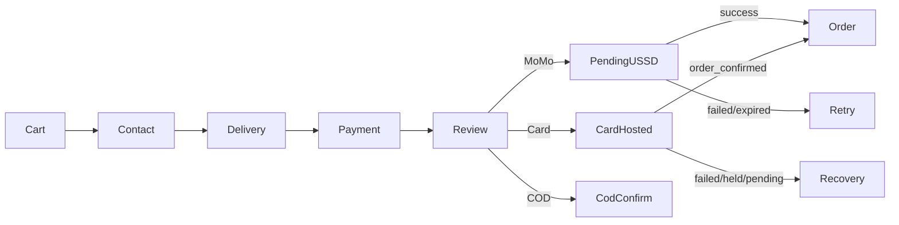

# Phase 4.3 — Cart & checkout presentation

**Base SHA:** `d9839db349887ab48a52c18546e05961a62498d6` (`master` / `origin/master`)  
**Working branch:** `cursor/customer-cart-checkout-ux-077d`  
**PR:** https://github.com/KaluMuso/Convergeo/pull/373  
**Audit refs:** `docs/design/vergeo5-ui-ux-audit.md` §4.6–4.7, E22

## Safety boundary

Presentation/UX only. No changes to ledger, settlement, escrow release, webhooks,
Lenco adapters, money math, or payment-option eligibility rules.

## Implementation plan

### Cart

- Distinguish **load failure** from empty cart (stop false-empty on network error).
- Initial cart store `loading: true` so the page does not flash empty before first fetch.
- Multi-seller fulfilment note when >1 vendor group.
- Escrow trust teaser on filled cart before sticky checkout CTA.
- Clearer vendor grouping headers; sticky summary with safe-area spacing.
- Surface `?notice=stock_unavailable` from checkout redirect.
- Desktop: items + sticky order summary column.

### Checkout

- Payment methods as selectable **cards** (same gates: MoMo/Card always; COD only when `cod_eligible`).
- Review: duplicate-submit guard; honest state when place-order handler is absent.
- Stronger aria-live for processing; scroll-to-error on validation.
- Keep Contact → Delivery → Payment → Review stepper (matches implemented flow).

## Checkout flow

## Payment-state matrix

| Method             | Shown when                       | Selectable                                  | After selection                      |
| ------------------ | -------------------------------- | ------------------------------------------- | ------------------------------------ |
| MoMo (MTN/Airtel)  | Always (unless kill-switch copy) | Yes                                         | Rail + payer → review → USSD pending |
| Card               | Always                           | Yes                                         | Explainer → review → Lenco hosted    |
| COD                | `cod_eligible`                   | Yes if eligible                             | Review → COD confirm (not “paid”)    |
| COD                | not eligible                     | No — unavailable copy with cap              | —                                    |
| Online (momo/card) | API `payments_disabled`          | Shown; continue fails with kill-switch copy | Honest alert — no fake success       |

## Screenshots

| File                                                   | What                                    |
| ------------------------------------------------------ | --------------------------------------- |
| `before-live-cart-1366.png`                            | Production empty cart baseline          |
| `after-cart-empty-1366.png`                            | Local empty cart (trust cues)           |
| `after-cart-360.png` / `after-cart-load-error-360.png` | Local load-error (API/CORS unavailable) |
| `after-checkout-gate-1366.png`                         | Checkout contact step + real stepper    |

Artifacts also under `/opt/cursor/artifacts/cart-checkout/`.

## Verification evidence

- Lint: `pnpm --filter customer lint` — pass
- Typecheck: `pnpm --filter customer typecheck` — pass
- Tests: `pnpm --filter customer test` — 373 passed
- Build: `pnpm --filter customer build` — pass
- Browser: empty cart, load-error (no API), checkout contact gate; payment cards + review covered by unit tests

### Accessibility notes

- Payment methods remain keyboard-selectable radios inside cards.
- COD ineligible is non-selectable unavailable panel with title + cap explanation.
- Place-order processing uses `aria-live` + button `loadingLabel`.
- Validation errors use `role="alert"`; scroll-into-view when supported.
- Disabled place-order when handler unwired includes visible explanation (not colour-only).

## Discovered domain / financial gaps (not fixed here)

1. **`CheckoutShell` does not pass `onPlaceOrder`** — review honestly disables place-order instead of implying success.
2. **Cart revalidate / notices API** incomplete relative to change-notice UI.
3. **Save-for-later** not supported by cart API.
4. Local CORS when API is down correctly surfaces load-error (dev env).

## Known limitations

- Filled multi-seller cart / payment-step browser shots need authenticated session + API.
- Dark theme not re-audited end-to-end in this pass (display preferences route exists).
- Place-order wiring is a follow-up domain PR, not presentation.

## Recommended next PR

Wire `CheckoutShell` → authoritative `POST /orders` (or existing place-order endpoint) with idempotent client keys, pending/failure redirects already used by MoMo/card pending pages — without changing ledger math.
