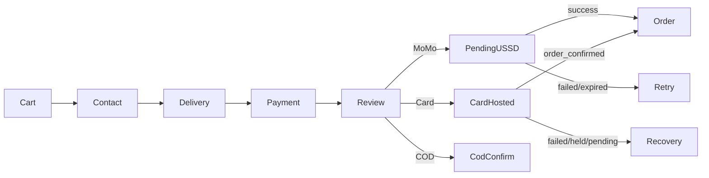

# Phase 4.3 — Cart & checkout presentation

**Base SHA:** `d9839db349887ab48a52c18546e05961a62498d6` (`master` / `origin/master`)  
**Working branch:** `cursor/customer-cart-checkout-ux-077d`  
**Audit refs:** `docs/design/vergeo5-ui-ux-audit.md` §4.6–4.7, E22

## Safety boundary

Presentation/UX only. No changes to ledger, settlement, escrow release, webhooks,
Lenco adapters, money math, or payment-option eligibility rules.

## Implementation plan

### Cart

- Distinguish **load failure** from empty cart (stop false-empty on network error).
- Multi-seller fulfilment note when >1 vendor group.
- Escrow trust teaser on filled cart before sticky checkout CTA.
- Clearer vendor grouping headers; sticky summary with safe-area spacing.
- Surface `?notice=stock_unavailable` from checkout redirect.
- Desktop: items + sticky order summary column.

### Checkout

- Payment methods as selectable **cards** (same gates: MoMo/Card always; COD only when `cod_eligible`).
- Review: duplicate-submit guard; honest state when place-order handler is absent.
- Stronger aria-live for processing; scroll-to-error on validation.
- Keep Contact → Delivery → Payment → Review stepper (matches implemented flow).

### Out of scope / discovered domain gaps

- `POST /orders` place-order not wired from `CheckoutShell` (document separately).
- `/cart/revalidate` + cart `notices` API incomplete (UI ready; backend gap).
- Save-for-later not supported (no cart API).

## Checkout flow

## Payment-state matrix

| Method            | Shown when                       | Selectable                     | After selection                      |
| ----------------- | -------------------------------- | ------------------------------ | ------------------------------------ |
| MoMo (MTN/Airtel) | Always (unless kill-switch copy) | Yes                            | Rail + payer → review → USSD pending |
| Card              | Always                           | Yes                            | Explainer → review → Lenco hosted    |
| COD               | `cod_eligible`                   | Yes if eligible                | Review → COD confirm (not “paid”)    |
| COD               | not eligible                     | No — unavailable copy with cap | —                                    |
