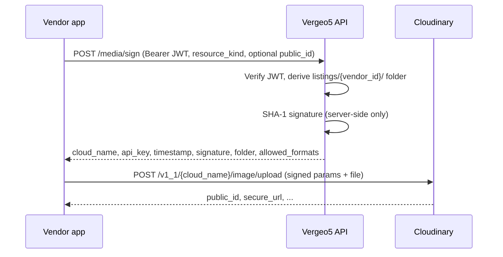

# Media pipeline

Vergeo5 listing images use **signed direct-to-Cloudinary uploads**: the API never receives file bytes. Vendors obtain short-lived upload parameters from the API, then POST the file straight to Cloudinary.

## Flow



1. Authenticated vendor calls `POST /media/sign` with `resource_kind` (currently `listing`), optional `public_id`, and optional `file_size_bytes` for pre-upload size checks.
2. API verifies the Supabase access token, derives the upload folder from the authenticated vendor scope, and returns signed parameters.
3. Client uploads directly to `https://api.cloudinary.com/v1_1/{cloud_name}/image/upload` with `api_key`, `timestamp`, `signature`, `folder`, `allowed_formats`, `max_file_size`, and the file.

## Folder convention

Upload folders are **server-derived** and scoped per vendor:

```text
listings/{vendor_id}/...
```

Clients cannot choose another vendor's folder. Any `folder` field sent in the sign request is ignored; the API always signs the folder for the authenticated vendor.

`public_id`, when provided, is sanitized to a single path segment (no `../` or slashes).

## Limits

| Constraint             | Value                                        |
| ---------------------- | -------------------------------------------- |
| Allowed formats        | `jpg`, `png`, `webp`, `avif`                 |
| Max listing image size | 10 MiB (`10_485_760` bytes)                  |
| Images per listing     | ≤ 8 (enforced in vendor UI — M12-P05)        |
| Signature validity     | 1 hour from `timestamp` (Cloudinary default) |

Oversized `file_size_bytes` in the sign request is rejected before a signature is issued. Cloudinary also enforces `max_file_size` via the signed parameters.

## Delivery (`f_auto`, `q_auto`)

After upload, customer-facing apps render images through the shared UI helpers in `packages/ui/src/media/cloudinary-url.ts`:

- `cldUrl` — `f_auto,q_auto,w_{width}` delivery URLs
- `cldSrcSet` — responsive widths 360 / 720 / 1080
- `cldLqipUrl` — tiny blurred placeholder

Configure `NEXT_PUBLIC_CLOUDINARY_CLOUD_NAME` in frontend environments for delivery URLs.

## D26 CDN swap seam

**The only place a CDN provider swap should happen is `packages/ui/src/media/cloudinary-url.ts`.**

Do not duplicate URL builders in the API or apps. Backend signing uses Cloudinary upload credentials from `CLOUDINARY_URL`; frontend delivery URLs stay centralized in the UI package so a future CDN migration touches one module.

## Environment

| Variable                            | Service      | Format                                             |
| ----------------------------------- | ------------ | -------------------------------------------------- |
| `CLOUDINARY_URL`                    | API          | `cloudinary://<api_key>:<api_secret>@<cloud_name>` |
| `NEXT_PUBLIC_CLOUDINARY_CLOUD_NAME` | Next.js apps | Cloud name for read-only delivery URLs             |

`api_secret` is parsed server-side only and must never be returned to clients or logged.

## Auth seam (M04-P02)

`services/api/app/media/authz.py` verifies Supabase JWTs today and derives `vendor_id` from token claims. Full vendor-role and ownership checks land in **M04-P02**.
