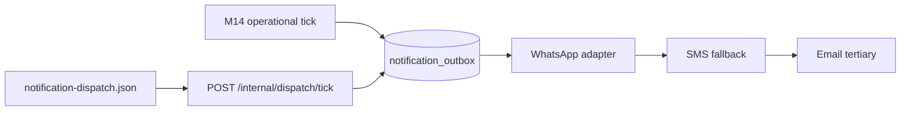

# n8n workflow registry

Operational n8n workflows for Vergeo5. **Logic stays in the API** — each workflow
calls an internal-token endpoint, enqueues rows to `notification_outbox`, and
relies on the **Notification Dispatch Tick** workflow (`notification-dispatch.json`)
to deliver via WhatsApp → SMS → email.

> M13-P11 will finalize import/export procedures and consolidate cross-mountain
> workflows. This file is owned by **M14-P06** for operational notification workflows.

## Security

- Every workflow uses `X-Internal-Token` from n8n credentials / `$env` — **never**
  inline secrets in JSON exports.
- Set `INTERNAL_N8N_TOKEN` on the API and mirror it in n8n (`$env.INTERNAL_N8N_TOKEN`).
- Founder payout alerts use `FOUNDER_WHATSAPP_E164` on the API (not in workflow JSON).

## Import (staging)

1. Open n8n at `https://n8n.vergeo5.com` (behind Caddy + basic auth).
2. **Workflows → Import from file** — select JSON from `infra/n8n/`.
3. Create an **HTTP Header Auth** credential named `Vergeo5 Internal N8N` with
   header `X-Internal-Token` = staging secret (or bind to `$env.INTERNAL_N8N_TOKEN`).
4. Replace `REPLACE_WITH_CREDENTIAL_ID` in each imported workflow.
5. Ensure n8n environment has `API_URL` (e.g. `https://api.vergeo5.com`).
6. Activate workflows only after F5 (WhatsApp) and dispatch tick are live.

## Registry

| Workflow file                | Trigger         | API endpoint                              | Recipient                           | Active default   | Owner   |
| ---------------------------- | --------------- | ----------------------------------------- | ----------------------------------- | ---------------- | ------- |
| `kyc-nudge.json`             | Every 6h        | `POST /internal/n8n/kyc-stalled/tick`     | Vendor applicant (48h+ pending KYC) | OFF              | M14-P06 |
| `payout-failure-alert.json`  | Every 1h        | `POST /internal/n8n/payout-failures/tick` | Founder WhatsApp                    | OFF              | M14-P06 |
| `low-stock-alert.json`       | Daily 07:00 UTC | `POST /internal/n8n/low-stock/tick`       | Vendor owner                        | OFF              | M14-P06 |
| `review-request.json`        | Every 4h        | `POST /internal/n8n/review-requests/tick` | Customer (+24h post-completion)     | OFF              | M14-P06 |
| `abandoned-cart.json`        | Every 2h        | `POST /internal/n8n/abandoned-carts/tick` | Customer                            | OFF (flag-gated) | M14-P06 |
| `notification-dispatch.json` | Every 1m        | `POST /internal/dispatch/tick`            | (outbox consumers)                  | OFF              | M14-P01 |

### Data sources (read-only GET mirrors)

| GET endpoint                    | Tables queried                                                               |
| ------------------------------- | ---------------------------------------------------------------------------- |
| `/internal/n8n/kyc-stalled`     | `kyc_records`, `vendors`, `profiles`                                         |
| `/internal/n8n/payout-failures` | `payouts`, `vendors`                                                         |
| `/internal/n8n/low-stock`       | `vendor_listings`, `vendors`, `profiles`, `platform_config`                  |
| `/internal/n8n/review-requests` | `orders`, `order_events`, `vendors`, `profiles`, `notification_outbox`       |
| `/internal/n8n/abandoned-carts` | `feature_flags`, `carts`, `profiles` (empty while `abandoned_cart` flag OFF) |

### Related workflows (other pebbles — do not edit here)

| File                       | Owner   |
| -------------------------- | ------- |
| `order-jobs.json`          | M09-P10 |
| `payment-sweeper.json`     | M08     |
| `release-job.json`         | M08-P08 |
| `reconciliation.json`      | M08     |
| `reservation-sweeper.json` | M07     |

## Dispatch chain

