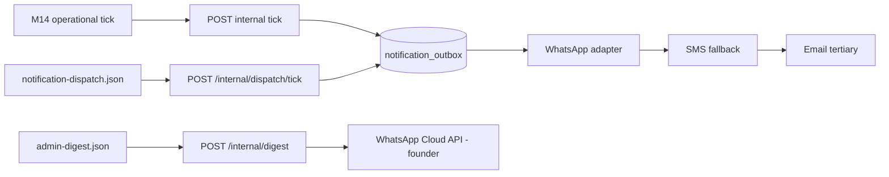

# n8n workflow registry

Complete registry of every operational n8n workflow for Vergeo5. **Logic stays in
the API** — each workflow calls an internal-token endpoint. Most operational nudges
enqueue rows to `notification_outbox` and rely on the **Notification Dispatch Tick**
workflow (`notification-dispatch.json`) to deliver via WhatsApp → SMS → email. The
founder digest (`admin-digest.json`) is the exception: it reads read-only aggregates
and delivers directly to the founder's WhatsApp.

> **This file is the single source of truth for `infra/n8n/*.json`.** Owned by
> **M13-P11** (finalized registry + import/export procedure). Every JSON in
> `infra/n8n/` MUST appear in the [Registry](#registry) table below — a completeness
> test (`services/api/tests/test_n8n_registry.py`) fails CI if a workflow is
> undocumented. When you add a workflow file, add its row here in the same PR.

## Security

- Every workflow uses `X-Internal-Token` from n8n credentials / `$env` — **never**
  inline secrets in JSON exports.
- Internal tokens are per-concern: `INTERNAL_N8N_TOKEN` (M14 operational nudges),
  `INTERNAL_DIGEST_TOKEN` (founder digest), plus the per-job tokens used by earlier
  ticks (e.g. `INTERNAL_ORDER_JOBS_TOKEN`, `INTERNAL_TICKETS_ISSUE_TOKEN`). Set each
  on the API and mirror it in n8n `$env`.
- Founder recipients use `$env` (`FOUNDER_WHATSAPP_TO` / `FOUNDER_WHATSAPP_E164`,
  `WHATSAPP_CLOUD_API_URL`, `WHATSAPP_CLOUD_API_TOKEN`) — never in workflow JSON.

## Registry

Every `infra/n8n/*.json` (schedule = `scheduleTrigger`; all default **inactive** —
activate per environment after credentials + F5 WhatsApp are live):

| Workflow file                | Trigger         | API endpoint                              | Purpose                                                          | Owner   |
| ---------------------------- | --------------- | ----------------------------------------- | --------------------------------------------------------------- | ------- |
| `admin-digest.json`          | Daily 06:00 UTC | `POST /internal/digest`                   | Founder daily digest: GMV, orders, payouts due, reconciliation, KYC queue, flags → WhatsApp | M13-P11 |
| `notification-dispatch.json` | Every 1m        | `POST /internal/dispatch/tick`            | Drain `notification_outbox` → WhatsApp → SMS → email             | M14-P01 |
| `kyc-nudge.json`             | Every 6h        | `POST /internal/n8n/kyc-stalled/tick`     | Nudge vendor applicants stalled 48h+ in pending KYC             | M14-P06 |
| `payout-failure-alert.json`  | Every 1h        | `POST /internal/n8n/payout-failures/tick` | Alert founder of failed payouts                                 | M14-P06 |
| `low-stock-alert.json`       | Daily 07:00 UTC | `POST /internal/n8n/low-stock/tick`       | Alert vendor owners of low-stock listings                      | M14-P06 |
| `review-request.json`        | Every 4h        | `POST /internal/n8n/review-requests/tick` | Request customer reviews +24h post-completion                  | M14-P06 |
| `abandoned-cart.json`        | Every 2h        | `POST /internal/n8n/abandoned-carts/tick` | Nudge customers with abandoned carts (flag-gated)              | M14-P06 |
| `order-jobs.json`            | Every 1h        | `POST /internal/order-jobs/auto-confirm`  | Auto-confirm delivered orders + auto-release escrow            | M09-P10 |
| `payment-sweeper.json`       | Every 5m        | `POST /internal/payment-sweeper/tick`     | Reconcile in-flight Lenco payment statuses                     | M08-P04 |
| `release-job.json`           | Every 1h        | `POST /internal/release-job/tick`         | Sweep eligible escrow releases                                 | M08-P08 |
| `reconciliation.json`        | Every 30m       | `POST /internal/reconciliation/poll-tick` | Poll Lenco + emit daily reconciliation report                 | M08-P07 |
| `reservation-sweeper.json`   | Every 2m        | `POST /internal/stock-sweeper/tick`       | Expire stale stock reservations                               | M07-P02 |
| `funnel-abandon.json`        | Every 5m        | `POST /internal/funnel/abandon-tick`      | Sweep abandoned checkout funnels for analytics                | M07-P08 |
| `embeddings-cron.json`       | Every 5m        | `POST /internal/embeddings/tick`          | Generate embeddings for pending catalog rows                  | M06-P01 |
| `event-release.json`         | Every 1h        | `POST /internal/event-release/tick`       | Release due event-escrow phases                               | M10-P08 |
| `tickets-issue.json`         | Every 60s       | `POST /internal/tickets/issue-tick`       | Issue tickets for paid ticket orders                          | M10     |
| `tickets-release.json`       | Every 2m        | `POST /internal/tickets/release-tick`     | Release stale ticket holds                                    | M10     |

### Founder digest aggregates (`admin-digest.json`)

`POST /internal/digest` (internal-token guarded, read-only) returns:

| Field              | Source (read-only)                                            |
| ------------------ | ------------------------------------------------------------- |
| `gmv_ngwee`        | `orders` × `order_items` (non-cancelled) — dashboard truth    |
| `orders`           | `orders` grouped by status (total + by-status)                |
| `payouts_due`      | `payouts` where `status = 'pending'` (count + `amount_ngwee`) |
| `reconciliation`   | latest `reconciliation_reports` row (green/red)               |
| `kyc_queue_depth`  | `kyc_records` where `status = 'pending'`                       |
| `flags_pending`    | `flags` where `status = 'open'`                                |

Numbers reuse the admin-dashboard aggregation helpers so the digest matches the
dashboard exactly.

## Import (staging)

1. Open n8n at `https://n8n.vergeo5.com` (behind Caddy + basic auth).
2. **Workflows → Import from file** — select JSON from `infra/n8n/`.
3. Create **HTTP Header Auth** credentials (`Vergeo5 Internal N8N`,
   `Vergeo5 Internal Digest`, `Vergeo5 WhatsApp Cloud API`) with the matching
   `X-Internal-Token` / `Authorization` header, or bind to the `$env` token.
4. Replace `REPLACE_WITH_CREDENTIAL_ID` in each imported workflow.
5. Ensure n8n `$env` has `API_URL` and the tokens listed under [Security](#security).
6. Activate workflows only after F5 (WhatsApp) and the dispatch tick are live.

## Export (keeping the registry in sync)

1. In n8n, **Workflows → ⋯ → Download** the workflow JSON.
2. Overwrite the matching `infra/n8n/*.json`; scrub credential IDs back to
   `REPLACE_WITH_CREDENTIAL_ID` and confirm no secrets are inlined (tokens stay `$env`).
3. Add/keep the workflow's row in the [Registry](#registry) table — the completeness
   test (`test_n8n_registry.py`) fails if a JSON file is missing from this doc.

## Dispatch chain

