# Vergeo5 — Whole Schema ERD (M03)

Mermaid entity-relationship diagram of every `public` table through migration `0011_rate_counters` (Wave 5). Money columns are **bigint ngwee** in Postgres; API exposes them as integer ngwee.

```mermaid
erDiagram
  %% ── Identity & vendors ──────────────────────────────────────────────────
  auth_users ||--|| profiles : "id"
  profiles ||--o{ user_roles : "user_id"
  profiles ||--o{ vendors : "owner_user_id"
  vendors ||--o{ vendor_locations : "vendor_id"
  vendors ||--o{ kyc_records : "vendor_id"

  auth_users {
    uuid id PK
  }

  profiles {
    uuid id PK
    text phone
    text display_name
    text locale
    jsonb notif_prefs
  }

  user_roles {
    uuid user_id PK
    text role PK
  }

  vendors {
    uuid id PK
    uuid owner_user_id FK
    text slug UK
    text status
    int kyc_tier
    bool preferred_badge
  }

  vendor_locations {
    uuid id PK
    uuid vendor_id FK
    float lat
    float lng
    text landmark
    jsonb hours
  }

  kyc_records {
    uuid id PK
    uuid vendor_id FK
    int tier
    text status
    text_array doc_storage_paths
  }

  %% ── Catalog ─────────────────────────────────────────────────────────────
  categories ||--o{ categories : "parent_id"
  categories ||--o{ products : "category_id"
  products ||--o{ vendor_listings : "product_id"
  vendors ||--o{ vendor_listings : "vendor_id"
  vendor_listings ||--o{ listing_images : "listing_id"

  categories {
    uuid id PK
    uuid parent_id FK
    text name
    text slug UK
    text path
    text commission_key
    bool vat_flag
    bool prohibited
  }

  products {
    uuid id PK
    text name
    text slug UK
    text brand
    jsonb spec
    uuid category_id FK
    text_array aliases
    text status
    uuid merged_into_id FK
  }

  vendor_listings {
    uuid id PK
    uuid vendor_id FK
    uuid product_id FK
    bigint price_ngwee
    text condition
    text stock_mode
    int stock_qty
    bool wholesale
    jsonb price_tiers
    int moq
    text status
  }

  listing_images {
    uuid id PK
    uuid listing_id FK
    text cloudinary_public_id
    int position
  }

  %% ── Services & events ───────────────────────────────────────────────────
  vendors ||--o{ services : "vendor_id"
  profiles ||--o{ jobs : "customer_id"
  jobs ||--o{ job_quotes : "job_id"
  vendors ||--o{ job_quotes : "provider_id"
  vendors ||--o{ events : "organiser_vendor_id"
  events ||--o{ event_instances : "event_id"
  event_instances ||--o{ ticket_types : "instance_id"
  event_instances ||--o{ tickets : "instance_id"
  ticket_types ||--o{ tickets : "ticket_type_id"

  services {
    uuid id PK
    uuid vendor_id FK
    text category
    text description
    bigint from_price_ngwee
  }

  jobs {
    uuid id PK
    uuid customer_id FK
    text category
    text status
    bigint budget_band
  }

  job_quotes {
    uuid id PK
    uuid job_id FK
    uuid provider_id FK
    bigint amount_ngwee
    text status
  }

  events {
    uuid id PK
    uuid organiser_vendor_id FK
    text venue
    text status
  }

  event_instances {
    uuid id PK
    uuid event_id FK
    timestamptz starts_at
    int capacity
  }

  ticket_types {
    uuid id PK
    uuid instance_id FK
    text kind
    bigint price_ngwee
    int qty_cap
  }

  tickets {
    uuid id PK
    uuid instance_id FK
    uuid ticket_type_id FK
    uuid order_item_id FK
    text status
    text qr_secret
  }

  %% ── Orders spine ────────────────────────────────────────────────────────
  profiles ||--o{ addresses : "user_id"
  profiles ||--o{ checkout_groups : "customer_id"
  checkout_groups ||--o{ orders : "checkout_group_id"
  vendors ||--o{ orders : "vendor_id"
  profiles ||--o{ orders : "customer_id"
  orders ||--o{ order_items : "order_id"
  order_items ||--o| order_item_products : "order_item_id"
  order_items ||--o| order_item_tickets : "order_item_id"
  order_items ||--o| order_item_services : "order_item_id"
  vendor_listings ||--o{ stock_reservations : "listing_id"
  checkout_groups ||--o{ stock_reservations : "checkout_group_id"
  orders ||--o{ order_events : "order_id"

  addresses {
    uuid id PK
    uuid user_id FK
    text landmark
    float lat
    float lng
  }

  checkout_groups {
    uuid id PK
    uuid customer_id FK
    bigint total_ngwee
    text idempotency_key UK
  }

  orders {
    uuid id PK
    uuid checkout_group_id FK
    uuid vendor_id FK
    uuid customer_id FK
    text status
    text fulfilment
    bigint fees_ngwee
    bool cod
  }

  order_items {
    uuid id PK
    uuid order_id FK
    text item_kind
    int qty
    bigint unit_price_ngwee
  }

  order_item_products {
    uuid order_item_id PK
    uuid listing_id FK
    uuid product_id FK
  }

  order_item_tickets {
    uuid order_item_id PK
    uuid ticket_id FK
  }

  order_item_services {
    uuid order_item_id PK
    uuid service_id FK
  }

  stock_reservations {
    uuid id PK
    uuid listing_id FK
    uuid checkout_group_id FK
    int qty
    timestamptz expires_at
  }

  order_events {
    uuid id PK
    uuid order_id FK
    text actor
    text from_status
    text to_status
  }

  %% ── Money & ledger ──────────────────────────────────────────────────────
  checkout_groups ||--o{ payments : "checkout_group_id"
  vendors ||--o{ ledger_accounts : "vendor_id"
  ledger_transactions ||--o{ ledger_postings : "transaction_id"
  ledger_accounts ||--o{ ledger_postings : "account_id"
  vendors ||--o{ payouts : "vendor_id"
  orders ||--o{ refunds : "order_id"
  orders ||--o{ invoices : "order_id"

  ledger_accounts {
    uuid id PK
    text kind
    uuid vendor_id FK
    text currency
  }

  ledger_transactions {
    uuid id PK
    text kind
    text reference
  }

  ledger_postings {
    uuid id PK
    uuid transaction_id FK
    uuid account_id FK
    bigint amount_ngwee
  }

  payments {
    uuid id PK
    uuid checkout_group_id FK
    text lenco_reference UK
    text rail
    text status
    bigint amount_ngwee
  }

  webhook_events {
    uuid id PK
    text provider
    text event_id UK
    bool signature_valid
    jsonb raw
  }

  payouts {
    uuid id PK
    uuid vendor_id FK
    bigint amount_ngwee
    text lenco_reference
    text status
  }

  refunds {
    uuid id PK
    uuid order_id FK
    int lane
    bigint amount_ngwee
    jsonb breakdown
    text status
  }

  invoice_counters {
    text series PK
    bigint next_no
  }

  invoices {
    uuid id PK
    bigint invoice_no
    uuid order_id FK
    jsonb snapshot
  }

  %% ── Trust & ops ─────────────────────────────────────────────────────────
  order_items ||--o| reviews : "order_item_id"
  orders ||--o{ disputes : "order_id"
  order_items ||--o{ returns : "order_item_id"

  reviews {
    uuid id PK
    uuid order_item_id FK
    int rating
    text body
    text status
  }

  disputes {
    uuid id PK
    uuid order_id FK
    uuid opener_id FK
    text status
    jsonb evidence_paths
  }

  returns {
    uuid id PK
    uuid order_item_id FK
    int lane
    jsonb fee_breakdown
    text status
  }

  notification_outbox {
    uuid id PK
    text dedupe_key UK
    text channel
    text template
    jsonb payload
    text status
  }

  audit_log {
    uuid id PK
    uuid actor_id
    text action
    text entity
    jsonb before
    jsonb after
  }

  flags {
    uuid id PK
    text entity_kind
    uuid entity_id
    text reason
    uuid reporter_id
  }

  %% ── Config ────────────────────────────────────────────────────────────────
  commission_rates {
    text category_key PK
    int rate_bps
  }

  delivery_zones {
    text zone_key PK
    text label
    bigint fee_ngwee
    bool active
  }

  platform_config {
    text key PK
    jsonb value
    text value_type
  }

  feature_flags {
    text flag_key PK
    bool enabled
  }

  merch_slots {
    uuid id PK
    text slot_key
    text variant_key
    jsonb payload
    timestamptz active_from
    timestamptz active_to
  }

  prohibited_categories {
    text category_key PK
    text reason
  }

  vendor_quotas {
    text quota_key PK
    int kyc_tier
    jsonb limits
  }

  config_audit {
    uuid id PK
    text table_name
    text row_key
    jsonb before
    jsonb after
  }

  %% ── Search projection ───────────────────────────────────────────────────
  search_documents {
    uuid id PK
    text entity_kind
    uuid entity_id
    text title
    tsvector tsv
    vector embedding
    bool is_public
  }

  synonyms {
    uuid id PK
    text term
    text canonical
  }

  %% ── Rate limiting (0011) ──────────────────────────────────────────────────
  rate_counters {
    uuid id PK
    text scope
    text key
    timestamptz window_start
    int count
    timestamptz expires_at
  }
```

## Table index (49 tables)

| Domain            | Tables                                                                                                                                                            |
| ----------------- | ----------------------------------------------------------------------------------------------------------------------------------------------------------------- |
| Identity          | `profiles`, `user_roles`, `vendors`, `vendor_locations`, `kyc_records`                                                                                            |
| Catalog           | `categories`, `products`, `vendor_listings`, `listing_images`                                                                                                     |
| Services & events | `services`, `jobs`, `job_quotes`, `events`, `event_instances`, `ticket_types`, `tickets`                                                                          |
| Orders            | `addresses`, `checkout_groups`, `orders`, `order_items`, `order_item_products`, `order_item_tickets`, `order_item_services`, `stock_reservations`, `order_events` |
| Money             | `ledger_accounts`, `ledger_transactions`, `ledger_postings`, `payments`, `webhook_events`, `payouts`, `refunds`, `invoice_counters`, `invoices`                   |
| Trust & ops       | `reviews`, `disputes`, `returns`, `notification_outbox`, `audit_log`, `flags`                                                                                     |
| Config            | `commission_rates`, `delivery_zones`, `platform_config`, `feature_flags`, `merch_slots`, `prohibited_categories`, `vendor_quotas`, `config_audit`                 |
| Search            | `search_documents`, `synonyms`                                                                                                                                    |
| Rate limiting     | `rate_counters`                                                                                                                                                   |

## Key SQL functions (not entities)

- `bump_rate_counter(scope, key, window, limit)` — atomic OTP/auth rate windows (`0011`)
- `search_rrf(query, embedding, filters)` — FTS + trgm + vector fusion (`0009`)
- `next_invoice_no(series)` — gapless invoice counter (`0006`)
- `has_role(role)` — JWT role check (`0002`)

## Seed data

Category tree + ~150 canonical product stubs live in [`supabase/seed.sql`](../../supabase/seed.sql) (not a numbered migration; `0010` is profile bootstrap).
