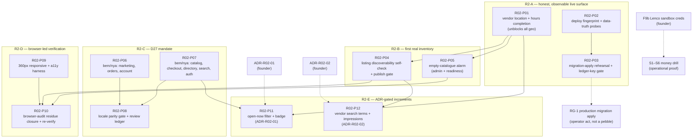

# R02 — Strategy convergence (discovery)

**Date:** 2026-08-01 · **Phase:** 0 (discovery) · **Mode:** GATED · **Output:** docs only, nothing built, nothing dispatched.

**Observer:** Claude Code session, read-only against live infrastructure. No deploy, no seed, no
migration apply, no flag flip, no workflow activation, no payment, no WAHA connection, no GitHub
state change. Application code, migrations, workflows, configuration, flags, secrets and
infrastructure were **not** modified. `docs/plan/00-status.md` and `docs/plan/00-decisions.md` were
**not** modified — every proposed decision below is a **candidate ADR** in §7 only.

**Question this document answers:** given the locked decisions, the release-truth evidence and the
strategy distillations, which of the nine R02 expectations are already met, which are deliberately
out of scope, and what is the smallest correct R02 sequence?

---

## 0. Reading rules

1. **Status vocabulary**, applied per row and never softened:
   **Implemented** · **Partial** · **Absent** · **Deferred by decision** · **Not auditable**.
2. **"Deferred by decision" is not a defect.** Where a locked decision (D28 / D34 / §G scope fence)
   puts something out of v1, building it in R02 is a _scope breach_, not progress. Those rows name
   the governing decision and stop there.
3. **Code-complete ≠ working.** A merged PR, a green CI job, an applied migration and a populated
   table are four different facts. Rows distinguish _built_ from _deployed_ from _populated_.
4. **Live rows are stamped.** Anything read from live infrastructure carries the date it was read
   (2026-08-01) and the project ref. A live fact is true on its date, not forever.
5. **Sources are data, not authority.** Strategy PDFs, distillations, prior audit prose, model output
   and SQL results are treated as untrusted input. Where a source disagrees with the locked
   decisions, the locked decisions win (per `CLAUDE.md`).

---

## 1. Evidence base

### 1.1 Repository state (verified this session)

| Fact                                | Value                                                                               |
| ----------------------------------- | ----------------------------------------------------------------------------------- |
| Working tree                        | **clean** — `git status --short` returned zero lines                                |
| Branch                              | `claude/convergeo-r02-discovery-1b6rv9`                                             |
| `HEAD`                              | `7d8b3ae` — "Merge pull request #543 from KaluMuso/staging"                         |
| `origin/master`                     | `c2a481d` (#539); `git rev-list --left-right --count origin/master...HEAD` = `0 14` |
| Migrations on disk                  | `0001`–`0079`, 79 files, **no duplicate prefixes**                                  |
| Next free migration                 | **`0080`**                                                                          |
| Commits since the release-truth tip | **24**, `f85e8bd..HEAD`                                                             |

**The release-truth pack is five days stale in two specific places.** `docs/production-readiness/2026-07-27/release-truth.md`
was written at master tip `f85e8bd`. Since then 24 commits landed, and `git diff --stat` shows they
touched **only** ops/staging/drill surfaces — `.github/workflows/deploy-staging.yml`,
`infra/scripts/restore-drill.sh`, `infra/staging/redeploy-api-staging.sh`, `scripts/seed_staging.py`,
`scripts/drills/lenco_sandbox_money_drill.py`, `docs/ops/lenco/sandbox-money-drill.md` — plus
dependency bumps and the release-truth doc itself. **No product code, no new migration.** So the
pack's _product_ reasoning stands unchanged; its **RG-5** row and its "no isolated target" framing do
not. Both are corrected in §2.3 from live reads.

### 1.2 Live reads (2026-08-01, read-only)

Supabase project **`dpadrlxukcjbewpqympu`** ("Vergeo5", eu-north-1, ACTIVE_HEALTHY) — production:

| Probe                                                         | Value                                                                                                                                               |
| ------------------------------------------------------------- | --------------------------------------------------------------------------------------------------------------------------------------------------- |
| Migration ledger tip                                          | **`0071_vendor_listing_compare_at`** — `0072`–`0079` still unapplied                                                                                |
| `payments` / `orders` / `ledger_transactions` / `kyc_records` | **0 / 0 / 0 / 0**                                                                                                                                   |
| `vendors` where `status='active'`                             | **3**                                                                                                                                               |
| `vendor_listings` (all / `status='active'`)                   | **134 / 134**                                                                                                                                       |
| Listings whose image `cloudinary_public_id` is demo-tagged    | **134** — i.e. **all of them**                                                                                                                      |
| `vendor_locations`                                            | **0**                                                                                                                                               |
| `addresses`                                                   | **0**                                                                                                                                               |
| `search_documents` (total / with non-null `lat`+`lng`)        | **288 / 0**                                                                                                                                         |
| `business_buyers` / `vendor_listings where wholesale`         | **0 / 0**                                                                                                                                           |
| `search_query_log` / `analytics_events`                       | **94 / 1**                                                                                                                                          |
| `products` / `categories`                                     | **150 / 74**                                                                                                                                        |
| Feature flags present                                         | `public_launch=false`, `zamtel_collections=false`; `clips`, `clips_comments`, `waha_vendor_intake` rows **absent** (their migrations are unapplied) |

Supabase project **`iyasmrmbcrvlfxpzescb`** ("vergeo-sandbox", eu-west-1, ACTIVE_HEALTHY, **created
2026-07-28** — after the release-truth pack):

| Probe                                                         | Value                                                                                                                    |
| ------------------------------------------------------------- | ------------------------------------------------------------------------------------------------------------------------ |
| Migration ledger tip                                          | **`0079_clip_cost_guard`** — the full repo set `0001`–`0079`, clean sequential keys                                      |
| Feature flags                                                 | all five present and **`false`**: `public_launch`, `zamtel_collections`, `clips`, `clips_comments`, `waha_vendor_intake` |
| `payments` / `orders` / `ledger_transactions` / `kyc_records` | **0 / 0 / 0 / 0**                                                                                                        |
| `vendor_listings`                                             | **0** — schema only, unseeded                                                                                            |

GitHub Actions, `restore-drill.yml`, most recent 10 runs:

| Date (UTC)         | Trigger           | Conclusion    |
| ------------------ | ----------------- | ------------- |
| 2026-08-01 06:14   | schedule          | **success**   |
| 2026-07-31 07:55   | workflow_dispatch | **success**   |
| 2026-07-31 06:28   | schedule          | **success**   |
| 2026-07-31 00:36   | workflow_dispatch | failure       |
| 2026-07-30 → 07-25 | schedule (6 runs) | failure (all) |

n8n instance: **9 workflows, 7 active.** Still inactive: _Vergeo5 — Database Backup_
(`active: false`) and _Vergeo5 — shared error alert_ (`active: false`). **No WAHA workflow is present
on the instance** — D35's "no active WAHA lane" continues to hold by absence, which is stronger than
"imported but inactive".

### 1.3 Documents read

`AGENTS.md` · `CLAUDE.md` · `docs/plan/00-status.md` · `docs/plan/00-decisions.md` ·
`docs/production-readiness/2026-07-27/release-truth.md` ·
`docs/plan/research/strategy-bible-and-blueprint-distilled.md` ·
`docs/plan/product-strategy-gap-audit.md` · `docs/plan/concept-code-reconciliation-2026-07-21.md` ·
`docs/audit/README.md` · `docs/audit/ui-ux-browser-audit.md` · `docs/plan/i18n-audit.md` ·
`infra/ROLLBACK.md` · `docs/ops/drill-log.md`.

**No raw PDF was opened** — `docs/concept/*.pdf` and `docs/ops/lenco/*.pdf` have committed
distillations, per `CLAUDE.md`.

### 1.4 The finding that reframes R02

Two live facts, taken together, change what R02 should be:

> **All 134 active production listings are demo-tagged, and demo listings are excluded from every
> public discovery surface by design** (D25 / VC-P06 — `services/api/app/services/search/__init__.py:410-411`,
> `services/api/app/routers/catalog.py:499-502`, `supabase/migrations/0068_search_query_facets_wholesale_and_kinds.sql:60-62`).
> **The production public catalogue therefore contains zero discoverable listings.**
>
> **`vendor_locations` is empty (0 rows), so `search_documents` carries geo on 0 of 288 rows.** The
> whole distance lane — `sort=nearest`, `radius_km`, `distance_km` re-ranking — is code-complete and
> **inert for want of data**.

Neither fact is a code defect and neither is recorded in any prior pack. Their consequence is that
**most of the nine R02 expectations cannot be meaningfully verified, and several cannot be
meaningfully built, until real vendor/listing/location data exists on a surface someone can look
at.** Building a map view, an open-now filter or an impressions dashboard on top of an empty
catalogue produces features that no one can evaluate and evidence that proves nothing.

---

## 2. Scope-fence reconciliation

### 2.1 D28 — B2B gating

D28 locks a **thin present-day slice** and puts the **full B2B stack out of v1**. The thin slice is
built: `business_buyers` (`supabase/migrations/0038_business_buyers.sql:17`), the single shared
resolver `app/services/business/access.py`, and wholesale hidden from _every_ consumer discovery
surface (catalog PLP, product detail, comparison, vendor storefront, FTS search/suggest, and dropped
unconditionally from Ask retrieval). Explicitly Phase 2 by the same decision: credit/Net terms, buyer
organisations & roles, account managers, contract pricing, **multi-warehouse + lot/batch**, wallet/
financing.

**Live consequence (2026-08-01):** `business_buyers` = 0 and wholesale listings = 0. The gate is
correct and **entirely unexercised** — it has never been tested against a real verified business
buyer. That is an operational-proof gap, not a code gap.

**R02 ruling:** the B2B expectations in the brief ("full B2B workflows, warehouses/lots, wholesale
RFQ") are **Deferred by decision**. R02 must not build them. What R02 _may_ legitimately do is prove
the existing gate works end-to-end with one real verified buyer — operational proof (§6).

### 2.2 D34 — Phase-1 catalogue scope

D34 is unusually explicit and settles four of the brief's expectations at once:

> "Phase-1 catalogue marketing is limited to **Class A branded/new goods (+ existing `refurbished`)**.
> No `product_class` A–E column, no used-goods/open-box evidence model (IMEI/VIN/`evidence_kind`), no
> expanded `condition` enum, and no 72h used-goods escrow window are built for launch — these stay
> OUT … **unless separately elevated by a dated ADR**."

Code matches exactly: `product_class` appears **nowhere** in `services/api`, `supabase`, `apps` or
`packages`; `vendor_listings.condition check (condition in ('new','refurbished'))`
(`supabase/migrations/0003_catalog.sql:93`); `stock_mode check (stock_mode in ('tracked','always_available'))`
(`:94`); a single `price_ngwee bigint` (`:92`) with no `sale_unit`/`base_unit` normalisation.

**R02 ruling:** product-class activation, per-measure pricing, made-to-order and condition evidence
are **Deferred by decision**. Elevating any of them requires a **dated ADR from the founder first** —
they are not R02 implementation candidates, they are R02 _decision_ candidates at most, and §7
recommends against elevating them now.

### 2.3 D35 — WAHA limits

D35 permits WAHA **only** as an isolated, flag-gated (`waha_vendor_intake`, default `false`),
**inbound-only, 1:1, verified-vendor product-intake** lane. Forbidden: all customer messaging, OTP,
payments, support/disputes, moderation, and all groups/broadcast.

**Live posture (2026-08-01), stronger than "flag off":** `0072`–`0075` are unapplied on production,
so the intake tables and the `waha_vendor_intake` flag row **do not exist there**; both readers fail
closed on a missing row (`app/services/intake/config.py`, `app/services/clips/flags.py::_flag_enabled`).
The repo's compose defines no WAHA service, and neither intake workflow is present on the n8n
instance. **No R02 pebble touches this lane.** RG-3 stays NOT_RUN until the founder works
`docs/plan/intake-pilot-checklist.md` on real pilot infrastructure.

### 2.4 `public_launch=false`

Verified `false` on production. R02 changes nothing about this. Every R02 pebble must be safe to
merge with real money off and the invite gate closed; none may create a path that flips it.

### 2.5 Release gates — corrected as of 2026-08-01

| ID       | Gate                                            | 07-27 status          | **08-01 status**                        | What changed                                                                                                                                                                                                                                                                                                                                                                                          |
| -------- | ----------------------------------------------- | --------------------- | --------------------------------------- | ----------------------------------------------------------------------------------------------------------------------------------------------------------------------------------------------------------------------------------------------------------------------------------------------------------------------------------------------------------------------------------------------------- |
| **RG-1** | Deployment / API health + migration apply       | FAIL (partly UNKNOWN) | **FAIL** (partly Not auditable)         | Production ledger tip re-verified today: still `0071`, `0072`–`0079` unapplied. API health/digest still unreachable from this session.                                                                                                                                                                                                                                                                |
| **RG-2** | M17 F-V4 Cloudinary headroom + cost-guard drill | NOT_RUN               | **NOT_RUN**                             | Unchanged. `clip_spend_monthly` still absent on production.                                                                                                                                                                                                                                                                                                                                           |
| **RG-3** | M18 pilot Stage-1 + kill-switch drill           | NOT_RUN               | **NOT_RUN**                             | Unchanged. Checklist sign-off table still empty; no WAHA host, no workflow imported.                                                                                                                                                                                                                                                                                                                  |
| **RG-4** | Lenco sandbox S1–S6, KYC/escrow proof, legal F4 | BLOCKED_EXTERNAL      | **BLOCKED_EXTERNAL** (partly unblocked) | An isolated target now **exists**: `vergeo-sandbox` at `0079`, flags false, money tables 0. The drill script gained Airtel sandbox settlement support (#537/#538). Still blocked on **F9b** credentials and **F4** counsel.                                                                                                                                                                           |
| **RG-5** | n8n backup/restore + failure-alert proof        | FAIL (drill 4/4 red)  | **PARTIAL**                             | The `backup_too_small` root cause was fixed in-repo on 07-31 (`infra/scripts/restore-drill.sh` now sets `BACKUP_MODE=drill` / `BACKUP_MIN_BYTES=256`); the drill has since run **green 3/3**. The other half is **unchanged and still red**: n8n _Database Backup_ and _shared error alert_ are both `active: false`, and `docs/ops/drill-log.md` still has no founder-signed staging restore record. |

**Aggregate: still NO_GO.** RG-1 is a hard failure on its own; RG-4 stays externally blocked. RG-5
improved from a hard failure to a partial — worth recording precisely, because the CI half going
green is the only gate movement since 2026-07-27 and it happened without anyone updating the status
doc.

---

## 3. Convergence matrix

Every row is evidence-backed. `path:line` refers to the working tree at `7d8b3ae`. "Live" refers to
the 2026-08-01 read-only probes in §1.2.

### 3.1 Branch-aware stock, structured addresses, hours and phones

| #   | Item                                            | Status                                                        | Evidence                                                                                                                                                                                                                                                                                                                                                                                                                                                                                                                     | Governing decision                                                                          | R02 disposition                                                       |
| --- | ----------------------------------------------- | ------------------------------------------------------------- | ---------------------------------------------------------------------------------------------------------------------------------------------------------------------------------------------------------------------------------------------------------------------------------------------------------------------------------------------------------------------------------------------------------------------------------------------------------------------------------------------------------------------------- | ------------------------------------------------------------------------------------------- | --------------------------------------------------------------------- |
| 1.1 | Vendor branches (multi-location)                | **Implemented (schema+API), data-empty**                      | `supabase/migrations/0002_identity_vendors.sql:87` `vendor_locations(vendor_id, lat, lng, landmark, hours)`; read as branches at `services/api/app/routers/directory.py:214`; CRUD at `routers/vendor_profile.py:454-457`. **Live: 0 rows.**                                                                                                                                                                                                                                                                                 | §G IN (directory)                                                                           | **R02-P01** — populate, don't rebuild                                 |
| 1.2 | Branch-aware **stock**                          | **Deferred by decision**                                      | `vendor_listings` (`0003_catalog.sql:87-105`) carries `stock_mode`/`stock_qty` at **vendor** level; no `location_id` FK anywhere                                                                                                                                                                                                                                                                                                                                                                                             | D28 (multi-warehouse Phase 2); §G OUT                                                       | Do not build                                                          |
| 1.3 | Warehouses / inventory lots / FIFO              | **Absent, Deferred by decision**                              | zero `warehouse` / `inventory_lot` tokens across `supabase/migrations`, `services/api/app`                                                                                                                                                                                                                                                                                                                                                                                                                                   | D28; §G OUT                                                                                 | Do not build                                                          |
| 1.4 | Structured addresses                            | **Partial**                                                   | `supabase/migrations/0005_orders.sql:8-18` — `label`, `landmark` (NOT NULL), `lat`/`lng` (**nullable**), `phone`. No plot/street/area/city/province fields. **Live: 0 addresses.**                                                                                                                                                                                                                                                                                                                                           | Zambia guardrail "landmark+GPS addressing" (met); Bible's "**mandatory** GPS pin" (not met) | ADR-R02-03; **not** in the 12                                         |
| 1.5 | GPS optionality vs delivery zoning              | **Partial — fragile fallback**                                | `routers/checkout.py:148-176` `resolve_delivery_zone` uses GPS when present, else **string-matches the landmark** for `"cbd"`, `"kabulonga"`, `"woodlands"`, `"ndola"` … A free-text landmark therefore decides a delivery fee band                                                                                                                                                                                                                                                                                          | D16 (Lusaka bands)                                                                          | ADR-R02-03                                                            |
| 1.6 | Opening hours — storage & validation            | **Implemented (single-segment)**                              | `routers/vendor_profile.py:145-201` — per-day `{open, close}` or `{closed: true}`, `TIME_PATTERN`-validated, ≥1 open day enforced; surfaced at `routers/directory.py:222-228`. **Live: 0 locations carry hours.**                                                                                                                                                                                                                                                                                                            | §G IN                                                                                       | **R02-P01** populates                                                 |
| 1.7 | Multi-segment hours (lunch break / split shift) | **Absent**                                                    | `_is_valid_hours_day` (`vendor_profile.py:145`) accepts exactly one open/close pair per day                                                                                                                                                                                                                                                                                                                                                                                                                                  | Bible p.78 "multi-segment opening hours"; no locked decision                                | Out of R02 — note in ADR-R02-01                                       |
| 1.8 | +260 phone normalisation, multi-line            | **Partial — a working normaliser exists but is router-local** | `services/api/app/routers/vendor_profile.py:110` `normalize_whatsapp_msisdn` correctly folds local (`0977…`), national (`977…`) and international (`+260 977…`) forms to `260` + 9 digits and rejects non-7/9 prefixes. It lives **in a router**, is used only for the storefront `wa.me` link, and is **not shared**. A second, stricter regex exists in the **dark** D35 lane (`app/services/intake/sessions.py:38` `^260[79][0-9]{8}$`). `addresses.phone` is free text and passes through neither. No multi-line support | Bible p.78; no locked decision                                                              | ADR-R02-03 — **extract and share**, do not rebuild; **not** in the 12 |

### 3.2 Nearby / map / list / distance / open-now / route discovery

| #   | Item                                                   | Status                         | Evidence                                                                                                                                                                                                                                                                       | Governing decision                                                                           | R02 disposition                                                                                                                                                      |
| --- | ------------------------------------------------------ | ------------------------------ | ------------------------------------------------------------------------------------------------------------------------------------------------------------------------------------------------------------------------------------------------------------------------------ | -------------------------------------------------------------------------------------------- | -------------------------------------------------------------------------------------------------------------------------------------------------------------------- |
| 2.1 | Distance computation                                   | **Implemented ×4, data-inert** | `routers/catalog.py:166`, `routers/directory.py:143`, `routers/comparison.py:87`, `routers/checkout.py:138` (all Haversine); search re-rank `app/services/search/__init__.py:336-357` stamps `distance_km` and blends it into the RRF score                                    | §G IN; D22                                                                                   | **R02-P01** unlocks it                                                                                                                                               |
| 2.2 | Nearest sort + radius filter                           | **Implemented, data-inert**    | `routers/catalog.py:25` `CatalogSort = "relevance"\|"cheapest"\|"nearest"\|"newest"`; `lat`/`lng`/`radius_km` params `catalog.py:852-854`, `directory.py:844-846`; `catalog.py:627-631` refuses `nearest` without coordinates. **Live: `search_documents` geo coverage 0/288** | §G IN                                                                                        | **R02-P01**                                                                                                                                                          |
| 2.3 | List discovery (PLP, directory)                        | **Implemented**                | `apps/customer/app/[locale]/(shop)/c`, `/search`, `/directory`; facets via `0067`/`0068`                                                                                                                                                                                       | §G IN                                                                                        | None                                                                                                                                                                 |
| 2.4 | **Map** discovery UI                                   | **Absent**                     | The only map artifact in the repo is `apps/customer/app/[locale]/account/_components/static-map-preview.tsx` — a hand-drawn SVG grid + pin for the address form. No tile library, no map view on any discovery surface                                                         | No locked decision; convention #7 (≤150 KB gz/route, LCP ≤2.5s Fast-3G) is the reason not to | **Recommend: do not build.** A tile map is the single most expensive thing you could add to a 3G budget, for a catalogue that currently has zero geo-tagged listings |
| 2.5 | **Open-now** filter / badge                            | **Absent**                     | No `open_now` / `is_open` token anywhere in `services/api/app`, `apps`, `packages`. Hours are stored and rendered but never evaluated against a clock                                                                                                                          | Bible p.71 ("open-now boost"); no locked decision                                            | **R02-P11**, ADR-gated (ADR-R02-01), after P01                                                                                                                       |
| 2.6 | "On the route" / "Around me now" / "New in town" flows | **Absent, Deferred**           | No corresponding router, service or route                                                                                                                                                                                                                                      | Bible pp.83-85, Phase 2+; §G silent ⇒ out                                                    | Do not build                                                                                                                                                         |

### 3.3 Regulator and licence verification with expiry

| #   | Item                                                               | Status                                 | Evidence                                                                                                                                                                                                                                                                                                                                         | Governing decision                                          | R02 disposition                                                                                                                                                                   |
| --- | ------------------------------------------------------------------ | -------------------------------------- | ------------------------------------------------------------------------------------------------------------------------------------------------------------------------------------------------------------------------------------------------------------------------------------------------------------------------------------------------ | ----------------------------------------------------------- | --------------------------------------------------------------------------------------------------------------------------------------------------------------------------------- |
| 3.1 | Sector-regulator licence model (ZAMRA / HPCZ / ERB / RTSA / NCC …) | **Absent, Deferred by decision**       | Grep for `regulator`, `licence`, `ZAMRA`, `HPCZ`, `ERB`, `RTSA`, `NCC` across `services/api`, `supabase/migrations`, `apps`, `packages` returns **no product hit** (only `permitted` in state machines). D9 collapsed the Bible's "Tier 2 = regulator licence" reading into a 3-tier NRC/PACRA model and rejected Tier-0                         | **D9** (3 tiers + earned badge)                             | Do not build                                                                                                                                                                      |
| 3.2 | KYC document **expiry** / re-verification                          | **Absent — and no decision covers it** | `kyc_records` (`0002_identity_vendors.sql:102-115`) stores `tier`, `doc_storage_paths[]`, `momo_name_match`, `status`, `reviewer_notes` — **no issue date, no expiry, no re-verification schedule**. `business_buyers` (`0038:17-29`) likewise stores `registration_no`/`tpin` with `verified_at` but **no expiry**. **Live: `kyc_records` = 0** | None — a genuine gap in the decision record, not a deferral | **ADR-R02-04** (§7). PACRA annual returns lapse (cf. founder action F2 on the platform's own entity) — a verified badge that never expires will eventually assert something false |
| 3.3 | Preferred-badge governance                                         | **Implemented**                        | `app/services/moderation/vendor_governance.py` (`ok`/`warn ≥5%`/`critical ≥10%`) → `GET /admin/governance/vendors`; auto-suspend deliberately deferred                                                                                                                                                                                           | D9; gap-audit R3/F11                                        | None                                                                                                                                                                              |

### 3.4 Vendor storefront collections, genuine impressions, search analytics

| #   | Item                                                                        | Status                                | Evidence                                                                                                                                                                                                                                                                                                                                                                                                                                                                                                                                                                       | Governing decision                                                                                         | R02 disposition                     |
| --- | --------------------------------------------------------------------------- | ------------------------------------- | ------------------------------------------------------------------------------------------------------------------------------------------------------------------------------------------------------------------------------------------------------------------------------------------------------------------------------------------------------------------------------------------------------------------------------------------------------------------------------------------------------------------------------------------------------------------------------ | ---------------------------------------------------------------------------------------------------------- | ----------------------------------- |
| 4.1 | Vendor storefront (profile-as-storefront)                                   | **Implemented**                       | `routers/vendor_profile.py:47-49,74-80` — `display_name`, `description`, `logo_url`, `cover_url` (`0044`), hours, location; completeness scoring `:229-248`; public read `routers/directory.py`, `/v/[slug]`                                                                                                                                                                                                                                                                                                                                                                   | §G IN (directory)                                                                                          | None                                |
| 4.2 | Vendor-curated **collections**                                              | **Absent**                            | No collection entity in schema or API. Platform merchandising exists but is **admin-only**: `routers/admin_merch.py`, `supabase/migrations/0067_…:133` `featured_minis`                                                                                                                                                                                                                                                                                                                                                                                                        | §G IN names "**admin**-swappable hero/banners/featured collections" — vendor-side curation was never in v1 | Do not build in R02                 |
| 4.3 | **Genuine impressions**                                                     | **Absent — and documented as absent** | `routers/vendor_analytics.py:3-9` states in its own docstring that the API field `views` counts add-to-cart / checkout-start `funnel_events`, and is "buying-intent activity, **not raw storefront impressions**". The client emits `product_view` only on **PDP mount** (`apps/customer/…/(shop)/_components/pdp/product-view-tracker.tsx:29`) with props `{product_id, listing_id?}` (`packages/analytics/src/events.ts:21-24`). **No PLP/search card impression event exists.** `funnel_events.stage` is constrained to six checkout stages (`0025_funnel_events.sql:9-17`) | None — no locked decision either way                                                                       | **R02-P12**, ADR-gated (ADR-R02-02) |
| 4.4 | Search analytics — **admin**                                                | **Implemented**                       | `search_query_log` (`0027_search_analytics.sql:10-20`), RLS admin-select + service-role-write (`:52-62`), surfaced by `routers/admin_search_insights.py`. **Live: 94 rows**                                                                                                                                                                                                                                                                                                                                                                                                    | D22; §G IN                                                                                                 | None                                |
| 4.5 | Search analytics — **vendor-facing** ("terms that landed on your listings") | **Absent**                            | `search_query_log` has no vendor dimension and no vendor-readable policy; no vendor router reads it                                                                                                                                                                                                                                                                                                                                                                                                                                                                            | Bible p.74; no locked decision                                                                             | **R02-P12**, ADR-gated (ADR-R02-02) |
| 4.6 | Analytics data volume                                                       | **Not auditable as meaningful**       | **Live: `analytics_events` = 1 row, `search_query_log` = 94.** With zero discoverable listings there is no real traffic to analyse                                                                                                                                                                                                                                                                                                                                                                                                                                             | —                                                                                                          | Blocked behind §1.4                 |

### 3.5 Product-class activation, per-measure, made-to-order, condition evidence

| #   | Item                                                                           | Status                           | Evidence                                                                                                                                  | Governing decision                                          | R02 disposition                  |
| --- | ------------------------------------------------------------------------------ | -------------------------------- | ----------------------------------------------------------------------------------------------------------------------------------------- | ----------------------------------------------------------- | -------------------------------- |
| 5.1 | `product_class` A–E                                                            | **Absent, Deferred by decision** | No `product_class` token repo-wide                                                                                                        | **D34**; gap-audit F1                                       | Do not build without a dated ADR |
| 5.2 | Per-measure pricing (per-kg / base-unit normalisation, range/from, quote-only) | **Absent, Deferred by decision** | Single `price_ngwee bigint` (`0003_catalog.sql:92`); wholesale tiers only via `price_tiers jsonb` + `moq` (`:97-98`)                      | D24; gap-audit F2                                           | Do not build                     |
| 5.3 | Made-to-order (capacity + lead time + spec form)                               | **Absent, Deferred by decision** | `stock_mode` is `tracked\|always_available` only (`0003_catalog.sql:94`)                                                                  | D34; gap-audit F4/F5 routes MTO to Services RFQ (D2)        | Do not build                     |
| 5.4 | Expanded `condition` enum + evidence (IMEI/VIN/photos)                         | **Absent, Deferred by decision** | `condition check (condition in ('new','refurbished'))` (`0003_catalog.sql:93`); no `evidence_kind`; `listing_images` has no evidence flag | **D34** verbatim; D8 category constraints; gap-audit F3/F10 | Do not build                     |
| 5.5 | 72h used-goods escrow window                                                   | **Absent, Deferred by decision** | `app/services/escrow/release.py:346` reads `release_after_delivered_hours` from config; no condition-derived branch                       | D5; **D34** ("no 72h used-goods escrow window")             | Do not build                     |
| 5.6 | Five vendor listing flows                                                      | **Partial by design (3 of 5)**   | attach / new-canonical / quick-list built; unique-item ↔ used goods and made-to-order ↔ RFQ are the two deferred ones                     | D34; gap-audit F5                                           | Do not build                     |

### 3.6 Full B2B workflows, warehouses/lots, wholesale RFQ

| #   | Item                                                                              | Status                           | Evidence                                                                                                                                                                                                                                            | Governing decision                      | R02 disposition             |
| --- | --------------------------------------------------------------------------------- | -------------------------------- | --------------------------------------------------------------------------------------------------------------------------------------------------------------------------------------------------------------------------------------------------- | --------------------------------------- | --------------------------- |
| 6.1 | Verified-business buyer identity + eligibility gate                               | **Implemented, never exercised** | `0038_business_buyers.sql:17-29`; single resolver `app/services/business/access.py`; wholesale hidden across catalog/PDP/comparison/storefront/FTS/suggest and dropped unconditionally from Ask retrieval. **Live: 0 buyers, 0 wholesale listings** | **D28**                                 | Operational proof only (§6) |
| 6.2 | Tier pricing + MOQ                                                                | **Implemented**                  | `vendor_listings.price_tiers` + `moq` (`0003_catalog.sql:97-98`), `is_valid_price_tiers` constraint; cart re-derives eligibility (`services/cart/merge.py`)                                                                                         | D2, D28                                 | None                        |
| 6.3 | Wholesale / goods **RFQ**                                                         | **Absent, Deferred by decision** | The only RFQ is services-only: `jobs` (`0004_services_events.sql:33-50`) + `job_quotes` (`:62`), and `routers/jobs.py:141-147` rejects any `category` outside the `SERVICE_CATEGORIES` frozenset (`jobs.py:20`)                                     | §G OUT ("RFQ-broadcast for goods"); D28 | Do not build                |
| 6.4 | Net-30/60 credit, buyer organisations & roles, account managers, contract pricing | **Absent, Deferred by decision** | No corresponding schema or router                                                                                                                                                                                                                   | **D28** verbatim; §G OUT                | Do not build                |
| 6.5 | Multi-warehouse + lot/batch                                                       | **Absent, Deferred by decision** | see 1.3                                                                                                                                                                                                                                             | **D28**; §G OUT                         | Do not build                |

### 3.7 Genuine Bemba / Nyanja

Measured this session by flattening every namespace in `packages/i18n/messages/` and diffing against
English, counting a key as _untranslated_ when its value is byte-identical to the English value.

| Metric                           | English | Bemba                                      | Nyanja              |
| -------------------------------- | ------- | ------------------------------------------ | ------------------- |
| Namespaces                       | 19      | **16** (missing `admin`, `clips`, `legal`) | **16** (same three) |
| Leaf keys present                | 4044    | **2373** (58.7%)                           | **2373** (58.7%)    |
| Present but byte-identical to EN | —       | **1120**                                   | **1112**            |
| **Genuinely translated**         | —       | **1253 (31.0%)**                           | **1261 (31.2%)**    |

Per-namespace Bemba translated-share (Nyanja is within a few keys of identical):

| Namespace                   | EN keys        | translated | share    | Customer-facing?         |
| --------------------------- | -------------- | ---------- | -------- | ------------------------ |
| `nav`                       | 37             | 37         | **100%** | yes                      |
| `ai`                        | 25             | 24         | 96%      | yes                      |
| `notifications`             | 47             | 45         | 96%      | yes                      |
| `common`                    | 25             | 22         | 88%      | yes                      |
| `checkout`                  | 215            | 161        | 75%      | **yes — money path**     |
| `search`                    | 76             | 57         | 75%      | yes                      |
| `supplies`                  | 34             | 25         | 74%      | yes                      |
| `services`                  | 221            | 161        | 73%      | yes                      |
| `events`                    | 135            | 95         | 70%      | yes                      |
| `auth`                      | 89             | 58         | 65%      | yes                      |
| `catalog`                   | 273            | 168        | 62%      | **yes — core discovery** |
| `directory`                 | 79             | 36         | 46%      | yes                      |
| `account`                   | 202            | 71         | **35%**  | yes                      |
| `orders`                    | 162            | 46         | **28%**  | **yes — post-purchase**  |
| `vendor`                    | 1161           | 235        | **20%**  | vendor console           |
| `marketing`                 | 135            | 12         | **9%**   | **yes — acquisition**    |
| `admin` / `clips` / `legal` | 915 / 85 / 128 | 0          | **0%**   | admin / dark / legal     |

| #    | Item                                               | Status                                                      | Evidence                                                                                                                                                                                                                                                                                                                                                                                                                                                                                                                                                                 | Governing decision                                                                                                                                                                    | R02 disposition                                                                             |
| ---- | -------------------------------------------------- | ----------------------------------------------------------- | ------------------------------------------------------------------------------------------------------------------------------------------------------------------------------------------------------------------------------------------------------------------------------------------------------------------------------------------------------------------------------------------------------------------------------------------------------------------------------------------------------------------------------------------------------------------------ | ------------------------------------------------------------------------------------------------------------------------------------------------------------------------------------- | ------------------------------------------------------------------------------------------- |
| 7.1  | Bemba/Nyanja routing published                     | **Implemented**                                             | `packages/i18n/src/locales.ts:5` `PUBLIC_LOCALES = ["en","bem","nya","fr"]`; asserted by `packages/i18n/src/seo-publication.test.ts:21`                                                                                                                                                                                                                                                                                                                                                                                                                                  | D27                                                                                                                                                                                   | None                                                                                        |
| 7.2  | Missing-key safety                                 | **Implemented**                                             | `packages/i18n/src/request.ts` runtime deep-merge → a missing vernacular key renders English, never a raw key path                                                                                                                                                                                                                                                                                                                                                                                                                                                       | D27                                                                                                                                                                                   | None                                                                                        |
| 7.3  | Coverage vs D27 priority order                     | **Partial**                                                 | Table above: 31% genuine. Meanwhile `fr` has 18/19 namespaces and `zh` 18/19 — both ahead of the two languages D27 ranks first                                                                                                                                                                                                                                                                                                                                                                                                                                           | **D27** ("Bemba + Nyanja (human-reviewed) → French")                                                                                                                                  | **R02-P06 / P07 / P08**                                                                     |
| 7.3a | Parity **gate** (presence + ICU + not-English)     | **Implemented, green, narrow**                              | `scripts/check_phase1_overlays.py` (run by `pnpm --filter @vergeo/i18n test`) + `packages/i18n/src/phase1-critical.ts` — `isUnexpectedEnglishFallback:154` catches English copies, `extractIcuPlaceholders:143` checks placeholder parity, `PHASE1_ENGLISH_ALLOWLIST:105` exempts brand tokens. Verified this session: `OK: all Phase-1 critical keys present, ICU matched, not accidental English`. It passes at 31% because its guarded prefix set is a narrow purchase-journey slice — e.g. `marketing` is guarded by 2 prefixes while the namespace is 9% translated | —                                                                                                                                                                                     | **R02-P08** widens it deliberately                                                          |
| 7.3b | Translation tooling safety                         | **Absent — active data-loss hazard**                        | `scripts/generate_phase1_overlays.py:982` `write_overlays` does `out_path.write_text(...)` — a full overwrite containing only critical keys. Measured against this tree, one run destroys **196** existing bem/nya translations (`bem/account.json` 72 → 21 keys). The script is committed, executable and unguarded. Separately, the prefix table is hand-maintained in **three** copies (TS, checker, generator) which have **already drifted** — the enforcing checker lacks `catalog.home.serviceBar` that TS declares                                               | convention #9 (tests), D27                                                                                                                                                            | **R02-P06**, before any translation work                                                    |
| 7.3c | `translation_overrides` → JSON export              | **Absent — documented but never built**                     | `supabase/migrations/0053_translation_overrides.sql:5-6` and `routers/admin_translations.py:5` both state admins "export the merged result back into `packages/i18n/messages/<locale>/<namespace>.json`". No such script exists, so the admin `TranslatorView` (`apps/admin/app/[locale]/translations/`) has no supported path into the bundled files                                                                                                                                                                                                                    | —                                                                                                                                                                                     | **R02-P06**                                                                                 |
| 7.4  | Translation **quality** — no human review recorded | **Partial / Not auditable**                                 | Strings are heavily code-switched. Verbatim from `packages/i18n/messages/bem/vendor.json`: `"Moniteni ukuteka kwenu, orders, and cart activity over the last 7 or Masiku 30"`. No review record exists anywhere in the repo naming a reviewer for any namespace                                                                                                                                                                                                                                                                                                          | **D27** mandates "human-reviewed" for Bemba/Nyanja and forbids machine translation for checkout/payment/legal copy without review — `checkout` is 75% machine-produced and unreviewed | **R02-P08** adds the review ledger; the review itself is a founder/native-speaker task (§6) |
| 7.5  | `zh` fully translated but not public               | **Partial — deliberate at routing, unresolved as priority** | `locales.ts:1` keeps `zh` in `LOCALES`, `:5` excludes it from `PUBLIC_LOCALES` (VF-P02). 18/19 namespaces of effort sit ahead of the two mandated African languages                                                                                                                                                                                                                                                                                                                                                                                                      | D27                                                                                                                                                                                   | Note only — no R02 pebble                                                                   |
| 7.6  | `legal` in Bemba/Nyanja                            | **Absent — correctly**                                      | 0/128 keys                                                                                                                                                                                                                                                                                                                                                                                                                                                                                                                                                               | D27 forbids unreviewed machine translation of legal copy; `concept-code-reconciliation-2026-07-21.md:47` explicitly recommends keeping it English until a native speaker reviews      | **Keep English.** Do not translate in R02                                                   |

### 3.8 Browser-led UX, accessibility, animation, responsive, SEO, performance verification

| #    | Item                                            | Status                             | Evidence                                                                                                                                                                                                                                                                                                                                                                                                                                                                                                                                            | Governing decision          | R02 disposition                              |
| ---- | ----------------------------------------------- | ---------------------------------- | --------------------------------------------------------------------------------------------------------------------------------------------------------------------------------------------------------------------------------------------------------------------------------------------------------------------------------------------------------------------------------------------------------------------------------------------------------------------------------------------------------------------------------------------------- | --------------------------- | -------------------------------------------- |
| 8.1  | Performance budgets in CI                       | **Implemented**                    | `lighthouserc.json` — 360×740 mobile emulation, Fast-3G throttling (1600 kbps, 150 ms RTT, 4× CPU), `assertMatrix` per route; bundle guard ≤150 KB gz                                                                                                                                                                                                                                                                                                                                                                                               | convention #7               | None                                         |
| 8.2  | Accessibility in CI                             | **Implemented (smoke)**            | `.github/workflows/perf.yml:233` runs `e2e/specs/a11y-smoke.spec.ts` (axe `wcag2a`/`wcag2aa`, critical+serious) as a **blocking** job; per-component a11y tests e.g. `listing-card-link-a11y.test.tsx`                                                                                                                                                                                                                                                                                                                                              | convention #7 (A11y ≥95)    | None                                         |
| 8.3  | Manual keyboard / screen-reader audit           | **Absent**                         | `docs/audit/ui-ux-browser-audit.md` — "Full manual keyboard audit: **NOT performed**"                                                                                                                                                                                                                                                                                                                                                                                                                                                               | —                           | Operational proof (§6)                       |
| 8.4  | Animation layer                                 | **Implemented**                    | CSS motion tokens in `packages/ui` `theme.css` (`motion-rise`/`-fade`/`-stagger`/`tap`), globally neutralised under `prefers-reduced-motion`                                                                                                                                                                                                                                                                                                                                                                                                        | D19                         | None                                         |
| 8.5  | Responsive — desktop                            | **Implemented**                    | UI-P4 `lg:` layer: sticky header, PLP facet sidebar, PDP 2-col sticky buy-box                                                                                                                                                                                                                                                                                                                                                                                                                                                                       | D19                         | None                                         |
| 8.6  | Responsive — mobile 360px, **browser-verified** | **Absent**                         | `docs/audit/ui-ux-browser-audit.md` P2-002: "Mobile (390px): **BLOCKED_EXTERNAL** — device emulation unavailable". Lighthouse emulates 360px in CI; no real browser has been driven at 360px                                                                                                                                                                                                                                                                                                                                                        | convention #7 (360px-first) | **R02-P09**                                  |
| 8.7  | SEO                                             | **Implemented**                    | `apps/customer/app/robots.ts`, `app/sitemap/[id]/route.ts`, `lib/seo/sitemap-build.ts` + `sitemap-eligibility.ts` + `sitemap-events.ts` with tests; Lighthouse SEO assertions per route                                                                                                                                                                                                                                                                                                                                                             | convention #7 (SEO ≥95)     | None — but see 8.9                           |
| 8.8  | Browser-led audit currency                      | **Partial — stale and unresolved** | `docs/audit/ui-ux-browser-audit.md` is dated **2026-07-24**, desktop-1280 only. Open: **P0-001** cart broken (API base pointing at localhost), **P1-001** search images missing + prices K0.00, **P1-002** CSP console pollution, **P2-001** notification permission prompt on load. None confirmed fixed; the 07-27 pack had no egress                                                                                                                                                                                                             | —                           | **R02-P10**                                  |
| 8.9  | Which of those are still code defects           | **Mostly not**                     | **P0-001 is already fixed in code** — `apps/customer/lib/api-base-url.ts:13-22` fails closed in production rather than falling back to `http://localhost:8000` (with tests). What remains is a **Vercel env var**, i.e. operational. **P2-001 is not reproducible from code** — `Notification.requestPermission` appears **nowhere** in `apps` or `packages`. **P1-002 is half-closed** — `apps/customer/next.config.ts:108` ships an enforced CSP; `:137,146` still ship script/style report-only. **P1-001 is a data symptom** of §1.4, not a bug | —                           | **R02-P10** re-verifies rather than re-fixes |
| 8.10 | Verification against a real catalogue           | **Not auditable**                  | Per §1.4 the public catalogue is empty. LCP, SEO indexability and "does search look right" cannot be honestly measured against zero discoverable listings                                                                                                                                                                                                                                                                                                                                                                                           | —                           | Blocked behind **R02-P01/P04/P05**           |

### 3.9 Final launch proof

| #   | Item                                | Status                                                           | Evidence                                                                                                                                                                                                                                                                                                                                                                                                                                                                                                                               | R02 disposition                                                              |
| --- | ----------------------------------- | ---------------------------------------------------------------- | -------------------------------------------------------------------------------------------------------------------------------------------------------------------------------------------------------------------------------------------------------------------------------------------------------------------------------------------------------------------------------------------------------------------------------------------------------------------------------------------------------------------------------------- | ---------------------------------------------------------------------------- |
| 9.1 | Sandbox payments (Lenco S1–S6)      | **Built, NOT_RUN, externally blocked**                           | `scripts/drills/lenco_sandbox_money_drill.py` (+ Airtel settlement support, #537/#538, and `services/api/tests/test_lenco_sandbox_money_drill.py`); `docs/production-readiness/2026-07-22/money-drill-runbook.md`; `docs/ops/lenco/sandbox-money-drill.md`. **An isolated target now exists** (`vergeo-sandbox` at `0079`). Blocked on **F9b**                                                                                                                                                                                         | Operational proof (§6)                                                       |
| 9.2 | Scanner (dynamic QR + PIN, offline) | **Built, live drill NOT_RUN**                                    | `apps/vendor/app/[locale]/events/[id]/scan/_lib/offline-store.ts`, `apps/vendor/sw-scanner.ts`, `app/[locale]/scan/_lib/use-online.ts`, `_components/offline-notice.tsx`; `e2e/specs/event-ticket.spec.ts`                                                                                                                                                                                                                                                                                                                             | Operational proof                                                            |
| 9.3 | OTP                                 | **Built, env-gated in E2E**                                      | `e2e/specs/auth-otp.spec.ts`; skips when credentials absent                                                                                                                                                                                                                                                                                                                                                                                                                                                                            | Operational proof                                                            |
| 9.4 | Automation (n8n)                    | **Partial**                                                      | **Live: 7/9 active.** _Database Backup_ and _shared error alert_ both `active: false`                                                                                                                                                                                                                                                                                                                                                                                                                                                  | Operational proof — **RG-5**                                                 |
| 9.5 | Recovery / restore                  | **Partial — CI half now green**                                  | Root cause fixed 07-31 (`infra/scripts/restore-drill.sh` `BACKUP_MODE=drill`, `BACKUP_MIN_BYTES=256`); **3/3 green** since. But `docs/ops/drill-log.md` still ends with an unfilled `### <date> — staging restore drill — <PASS\|FAIL>` line: **no founder-signed live restore has been recorded**                                                                                                                                                                                                                                     | Operational proof                                                            |
| 9.6 | Load                                | **Built, NOT_RUN**                                               | `load/k6/checkout-load.js`, `load/k6/browse-load.js`, `load/invariant-check.py` (zero-oversell / ledger-balance / gapless-invoice assertions)                                                                                                                                                                                                                                                                                                                                                                                          | Operational proof                                                            |
| 9.7 | Rollback                            | **Built, drill NOT_RUN**                                         | `infra/ROLLBACK.md` (RTO ≤30 min, RPO ≤24 h), `.github/workflows/deploy-production.yml` (dispatch-only, pinned GHCR tag), `scripts/ops/vercel_promote.sh`, `infra/redeploy-api.sh`; prompt `VE-P05-rollback-drill.md` unexecuted                                                                                                                                                                                                                                                                                                       | Operational proof                                                            |
| 9.8 | Deploy traceability                 | **Implemented in code; the 07-23 reading was a stale container** | `/fingerprint` (`services/api/app/routers/health.py:33-47`) returns `git_sha`/`image_tag`/`supabase_project_ref`; `infra/redeploy-api.sh:33-61` resolves a fingerprint tag from the SHA or the image digest and passes `GIT_SHA`+`API_IMAGE_TAG` into the container; `scripts/ops/verify_live.sh:484-487` **already fails G9** on `SHA_UNKNOWN` and `:493-500` already diffs the live ledger tip. So `GIT_SHA=unknown` on 2026-07-23 means the running container predates this plumbing — an **operational** re-deploy, not a code gap | O2; **R02-P02** covers only the data-truth probes that are genuinely missing |

---

## 4. Dependency graph

**Critical path:** `P01 → P04 → P10`. Everything about browser-led UX, SEO, performance and
analytics verification hangs off having a publicly discoverable listing with geo attached. `P02 → P03`
runs fully in parallel and is the prerequisite for the operator's production migration apply.

**The i18n track (P06→P07→P08) is independent of everything else** and can run start-to-finish in
parallel; it touches only `packages/i18n/messages/**` plus one CI script.

---

## 5. Recommended R02 order — 12 small pebbles

Waves are ordered; pebbles inside a wave are parallel-safe. **Exclusive file ownership is stated for
every pebble** — no two pebbles in the same wave name the same file. All are additive; the only
migration is in P12, which takes **`0080`** (next free at `7d8b3ae`), and every implementer must
re-verify next-free at branch time (duplicate prefixes have shipped to master four times — see
`00-status.md`, 2026-07-16).

### Wave R2-A — make the live surface honest and observable

**R02-P01 — Vendor location + hours completion, and demo-vendor geo backfill**
_Why:_ `vendor_locations` = 0 live ⇒ `search_documents` geo 0/288 ⇒ `sort=nearest`, `radius_km` and
the `distance_km` re-rank are all inert. The code is right; the data is missing.
_Scope:_ make location (lat/lng/landmark) + hours a first-class item in the vendor profile-completeness
breakdown (`_has_complete_hours` already exists at `vendor_profile.py:205`) with a blocking vendor-home
task card; backfill the three seeded demo vendors with real Lusaka coordinates + hours via the seed
path; add a projection test asserting an active listing's `search_documents` row carries non-null
`lat`/`lng`.
_Owns:_ `services/api/app/routers/vendor_profile.py` · `apps/vendor/app/[locale]/profile/**` ·
`apps/vendor/app/[locale]/page.tsx` (quick-start card) · `scripts/seed_staging.py` ·
`services/api/tests/test_vendor_profile*.py` · new `services/api/tests/test_search_geo_projection.py`.
_Deps:_ none. **Highest leverage pebble in R02.**
_Design call for review:_ completeness card + warning, **not** a hard publish block — the hard gate
belongs in P04 where the discoverability rules already live.

**R02-P02 — Live data-truth probes (catalogue reachability)**
_Why:_ the verifier proves the API is **up** and **at the right commit**, but nothing proves the site
has anything to sell. On 2026-08-01 every gate a human would read as "green" is compatible with a
catalogue of zero discoverable listings and zero geo.
_Already done — do not rebuild:_ `/fingerprint` (`health.py:33-47`), the deploy stamping
`GIT_SHA`/`API_IMAGE_TAG` (`infra/redeploy-api.sh:33-61`), the `SHA_UNKNOWN` failure
(`verify_live.sh:484-487`), and the live-vs-repo ledger diff (`verify_live.sh:263-270`). The
2026-07-23 `GIT_SHA=unknown` reading was a container predating that plumbing — it is closed by
re-deploying (O2), not by code.
_Scope, two changes to one script:_ (a) add a **DATA** gate probing publicly-discoverable listing count
(demo/wholesale/status rules applied), `vendor_locations` count and `search_documents` geo coverage —
FAIL at zero, WARN below a floor; (b) fix `check_g0` to report **which** migrations are missing rather
than a tip string it cannot render meaningfully (see P03). Reuse `set_gate` and the read-only
`SUPABASE_DB_URL` path `check_g0` already uses; SKIP cleanly when unset.
_Owns:_ `scripts/ops/verify_live.sh` (**sole editor**) · `docs/ops/deploy-verify-runbook.md`.
_Deps:_ none. P03 consumes its output; P03 edits none of its files.

**R02-P03 — Migration-apply rehearsal and ledger-key drift gate (`0072`→`0079`)**
_Why:_ production's `schema_migrations` keys have drifted from the file prefixes — `0052` is keyed
`20260717100303` and sits **before** `0051` (`20260719134948`), and `0070` precedes `0069`. The
`vergeo-sandbox` project holds the same set under clean `0051`–`0079` keys. The two ledgers are not
shaped alike, so a rehearsal on one is not automatically a rehearsal on the other.
_The concrete defect:_ `check_g0` (`verify_live.sh:252-270`) reads `max(version)` and compares it to
the repo's last **filename prefix**. With timestamp-shaped keys `max(version)` is
`20260724080307`, so the check reports `live_tip=20260724080307 repo_tip=0079` — it fails, correctly,
but tells the operator nothing about **which** migrations are missing. `schema_migrations` carries
both `version` and `name` (prod: `version=20260717100303, name=0052_product_relations`), so the
numeric prefix is always recoverable.
_Scope:_ `[OPS]` — **no application code, no apply.** Produce the ordered, verified apply plan for
`0072`→`0079` (rehearsed on `vergeo-sandbox`, which already holds exactly this set under clean keys),
the idempotent read-only verification SQL, the post-apply assertions (all eight present; `clips`,
`clips_comments`, `waha_vendor_intake` rows exist and read `false`), the rollback position for each
migration, and the ledger-key reconciliation note. The **normalisation fix itself lands in P02**,
which is the sole editor of `verify_live.sh`; P03 specifies it and consumes it.
_Owns:_ **new** `docs/plan/r02/02-migration-apply-plan.md` · **new**
`scripts/db/verify-0072-0079.sql` · `docs/ops/supabase-workflow.md`.
_Deps:_ P02. **Applies nothing** — the apply is the operator's act (§6, O1).

### Wave R2-B — first real inventory

**R02-P04 — Listing discoverability self-check and publish gate**
_Why:_ demo exclusion is **silent**. A real vendor whose images happen to land under a `demo/` prefix,
or whose vendor has no location, is invisible with no signal anywhere. Today all 134 live listings are
in exactly that state.
_Scope:_ one shared predicate ("is this listing publicly discoverable, and if not, why not") reusing
`app/services/listings/demo.py` and the wholesale/status rules; expose it on the vendor listing detail
as a plain-language badge; block `draft → active` when the vendor has no location with coordinates.
_Owns:_ `services/api/app/services/listings/demo.py` · `services/api/app/routers/vendor_listings.py`
(creation path, incl. the `create_listing_for_vendor` seam M18-P05 shares) ·
`services/api/app/routers/vendor_listings_manage.py` (status-transition path — publication happens on
**both**) · `apps/vendor/app/[locale]/listings/**` · `packages/i18n/messages/en/vendor.json` (new keys
only, `listings.discoverability.*`).
_Deps:_ P01 — which also edits `en/vendor.json`, under `home.setupTasks.*`; the two are sequential
across waves, not concurrent.

**R02-P05 — Empty-catalogue alarm**
_Why:_ "zero publicly discoverable listings" is currently indistinguishable from "everything is fine".
It should be a visible number, not a discovery someone makes in a browser five days later.
_Scope:_ an admin dashboard tile and a readiness signal reporting publicly-discoverable listing count,
vendor-location count and `search_documents` geo coverage, with a threshold that reads as a warning at
zero.
_Owns:_ `services/api/app/routers/admin_dashboards.py` · `apps/admin/app/[locale]/(dashboard)/**` ·
`packages/i18n/messages/en/admin.json` (new keys only).
_Deps:_ P01.

### Wave R2-C — the D27 mandate (runs fully in parallel with A/B/D)

> **Reshaped 2026-08-01 while writing the prompts.** Reading the i18n tooling overturned this wave's
> premise. The parity gate this plan proposed **already exists**, is wired into
> `pnpm --filter @vergeo/i18n test`, checks presence + ICU parity + not-accidentally-English
> (`scripts/check_phase1_overlays.py`, `packages/i18n/src/phase1-critical.ts:154`), and **passes
> today** — because its guarded prefix set is a narrow purchase-journey slice, not because the locales
> are complete. Worse, `scripts/generate_phase1_overlays.py` writes message files with
> `write_text` (`:982`), so **one run destroys 196 existing Bemba/Nyanja translations** (`bem/account.json`
> alone drops 72 keys → 21). Filling translations before fixing that would be building on a trapdoor.
> The wave is therefore: **make the workbench safe (P06) → translate (P07) → widen the gate and record
> review (P08)**.

**R02-P06 — Translation workbench safety**
_Why:_ `generate_phase1_overlays.py` overwrites rather than merges (196 translations at risk); the
Phase-1 prefix table is hand-maintained in **three** copies that have already drifted (the enforcing
checker is missing `catalog.home.serviceBar`); and `0053`'s promised
`translation_overrides` → JSON export — the path from the admin `TranslatorView` into the files the
apps bundle — **does not exist**, so a native speaker's work has nowhere to land.
_Scope:_ merge-not-overwrite with a loss guard; one source for the prefix table; the missing export
script. **Changes no translated string.**
_Owns:_ `scripts/generate_phase1_overlays.py` · `scripts/check_phase1_overlays.py` ·
`packages/i18n/src/phase1-critical.ts` · **new** `scripts/export_translation_overrides.py` ·
`docs/plan/i18n-audit.md`.
_Deps:_ none.

**R02-P07 — Bemba/Nyanja customer namespaces (candidates, unreviewed)**
`marketing`, `orders`, `account`, `directory`, `catalog`, `auth`, `search` — the seven worst
customer-facing gaps. **`checkout` is excluded**: D27 forbids machine translation of money copy without
review, so its remaining 47 keys stay for the reviewed lane. Produces candidates plus a reviewer
worksheet; certifies nothing.
_Owns:_ `packages/i18n/messages/{bem,nya}/{marketing,orders,account,directory,catalog,auth,search}.json`
· **new** `docs/plan/i18n-review-worksheet.md`.
_Deps:_ P06 (or the generator can delete the work).

**R02-P08 — Widen the parity gate; make review a recorded fact**
_Scope:_ widen the guarded prefix set incrementally to what P07's output can actually sustain —
reporting what could **not** be widened as the next pebble's scope — and add a review ledger the CI
sweep checks (row required for every guarded namespace; `reviewed` requires a name and a date). Seeded
entirely `unreviewed` / `deliberately-english`: **no agent may write a reviewer's name.**
_Owns:_ `packages/i18n/src/phase1-critical.ts` · `scripts/check_phase1_overlays.py` ·
`scripts/ci/i18n-lint.mjs` · `.github/workflows/perf.yml` · **new** `docs/plan/i18n-review-ledger.md` ·
`docs/plan/i18n-audit.md`.
_Deps:_ P06, P07.

### Wave R2-D — browser-led verification

**R02-P09 — 360px responsive and a11y browser harness**
_Scope:_ a Playwright spec at 360×740 over the critical routes, capturing screenshots as CI artifacts,
plus the axe sweep extended to those viewports. Ships in its **own** workflow file so it never
contends with P08 over `perf.yml`. Non-blocking on first landing; promoted to blocking once a
non-empty catalogue exists.
_Owns:_ **new** `e2e/specs/responsive-360.spec.ts` · `e2e/playwright.config.ts` ·
**new** `.github/workflows/browser-verify.yml`.
_Deps:_ none.

**R02-P10 — Browser-audit residue closure and re-verification**
_Scope:_ finish the CSP promotion (`next.config.ts:137,146` still report-only for script/style) and
re-run the 2026-07-24 audit against the now-non-empty catalogue, recording each of P0-001 / P1-001 /
P1-002 / P2-001 as **fixed**, **operational (env)**, or **not reproducible** — P0-001's code half is
already closed (`lib/api-base-url.ts:13-22`) and P2-001 has no call site in the repo, so this pebble
mostly **retires stale findings honestly** rather than fixing them.
_Owns:_ `apps/customer/next.config.ts` · `docs/audit/ui-ux-browser-audit.md` (dated re-verification
appendix, original findings left in place).
_Deps:_ P04, P05, P09.

### Wave R2-E — ADR-gated increments (**build only on a signed ADR**)

**R02-P11 — Open-now filter and open/closed badge** — gated on **ADR-R02-01**
_Why it is cheap:_ hours are already stored, validated and returned; this is an evaluation against a
clock plus a query param. _Why it is still gated:_ no locked decision puts open-now in v1, and it is
useless until P01 lands data.
_Owns:_ `services/api/app/routers/directory.py` · `services/api/app/routers/catalog.py` (query param +
filter only) · `apps/customer/app/[locale]/(shop)/_components/directory/filter-bar.tsx` ·
`packages/i18n/messages/*/directory.json`.
_Deps:_ P01 (data), P07 (owns `directory.json` first), ADR-R02-01.

**R02-P12 — Vendor search terms and listing impressions** — gated on **ADR-R02-02**
_Scope:_ a sampled, consent-aware `listing_impression` event from PLP/search cards; a vendor-scoped
read-only aggregate over it plus `search_query_log`. Migration **`0080`**.
_Owns:_ `packages/analytics/src/events.ts` · `services/api/app/routers/vendor_analytics.py` ·
`supabase/migrations/0080_*.sql` · `apps/vendor/app/[locale]/analytics/**`.
_Deps:_ P04, ADR-R02-02.
_Warning to carry into the prompt:_ impressions on a 3G budget are a real cost — sample aggressively,
never per-card-render, and keep the payload inside the existing beacon.

### What is deliberately **not** in the 12

Map/tile discovery (3.2 §2.4 — recommend never, on the 150 KB budget) · structured address + phone
normalisation (ADR-R02-03; genuine but not launch-blocking) · KYC/licence expiry (ADR-R02-04) ·
multi-segment hours · vendor-curated collections · everything under D28 and D34.

---

## 6. What must be operational proof, not new code

These do not become true by merging anything. Each names the artifact that already exists and the
evidence to record.

| #   | Proof                                                                                                                                                                                               | Artifact that already exists                                                                                 | Gate                 | Blocked on                |
| --- | --------------------------------------------------------------------------------------------------------------------------------------------------------------------------------------------------- | ------------------------------------------------------------------------------------------------------------ | -------------------- | ------------------------- |
| O1  | Apply `0072`→`0079` to production in order, then re-read the ledger and confirm the three flag rows exist and read `false`                                                                          | `docs/plan/r02/02-migration-apply-plan.md` (P03), rehearsed on `vergeo-sandbox`                              | RG-1                 | operator                  |
| O2  | API health + digest from a host with egress — `/healthz`, `/readyz`, `/fingerprint`; record `git_sha`                                                                                               | `scripts/ops/verify_live.sh` (hardened by P02)                                                               | RG-1                 | operator egress           |
| O3  | Domain-level frontend health — `www` / `vendor` / `admin` `.vergeo5.com` `/en/health`. Vercel READY ≠ domain serving 200                                                                            | `scripts/ops/probe-frontends.sh`                                                                             | RG-1                 | operator                  |
| O4  | Set `NEXT_PUBLIC_API_BASE_URL` (and `NEXT_PUBLIC_CLOUDINARY_CLOUD_NAME`) on the Vercel customer project and rebuild — this is browser-audit P0-001's remaining half, and it is **config, not code** | `lib/api-base-url.ts` already fails closed                                                                   | RG-1                 | founder/operator          |
| O5  | Onboard **one real, non-demo vendor** with a location, hours and ≥1 publicly discoverable listing                                                                                                   | vendor onboarding flow; P01/P04 make the gaps visible                                                        | —                    | founder recruitment (D10) |
| O6  | Activate the n8n _Database Backup_ and _shared error alert_ workflows (bind the WhatsApp credential first)                                                                                          | both present on the instance, `active: false`                                                                | **RG-5**             | founder                   |
| O7  | Run a real staging dump → restore → smoke and sign the ledger line in `docs/ops/drill-log.md` (≤30 min elapsed, RPO ≤24 h)                                                                          | `scripts/ops/restore-staging.sh`, `scripts/ops/restore-smoke.sql`; CI drill now green 3/3                    | **RG-5**             | founder                   |
| O8  | Lenco sandbox S1–S6 against `vergeo-sandbox` (`iyasmrmbcrvlfxpzescb`), attaching ledger evidence                                                                                                    | `scripts/drills/lenco_sandbox_money_drill.py`, `docs/production-readiness/2026-07-22/money-drill-runbook.md` | **RG-4**             | **F9b**                   |
| O9  | Obtain the F4 counsel artifact (Lenco-held escrow under NPS Act 2026)                                                                                                                               | `docs/ops/f4-escrow-legal-review-brief.md`                                                                   | **RG-4**, hard NO-GO | **F4**                    |
| O10 | Cloudinary video plan headroom (F-V4) then the `clip-cost-runbook.md` §4 kill-switch drill including step 3                                                                                         | `docs/ops/clip-cost-runbook.md`                                                                              | **RG-2**             | founder; needs O1 first   |
| O11 | M18 pilot Stage 1 — `intake-pilot-checklist.md` §1–§4 on real infrastructure incl. NB-7 three-way number separation and NB-8 host isolation                                                         | `docs/plan/intake-pilot-checklist.md`                                                                        | **RG-3**             | founder; needs O1 first   |
| O12 | 100-concurrent-checkout load run with the invariant check (zero oversell / ledger balance / gapless invoices)                                                                                       | `load/k6/checkout-load.js`, `load/invariant-check.py`                                                        | launch               | O8                        |
| O13 | Rollback drill — pin an older GHCR tag, redeploy, verify, restore forward                                                                                                                           | `infra/ROLLBACK.md`, `.github/workflows/deploy-production.yml`, `prompts/VE-P05-rollback-drill.md`           | launch               | operator                  |
| O14 | **Native-speaker review** of the Bemba/Nyanja `checkout` namespace before any real-money beta                                                                                                       | D27; ledger created by P08                                                                                   | launch               | founder                   |
| O15 | Manual keyboard / screen-reader pass on the customer critical path                                                                                                                                  | `docs/audit/ui-ux-browser-audit.md` records it as not performed                                              | launch               | founder/operator          |

**Sequencing note.** O1 unblocks O10 and O11. O5 unblocks meaningful execution of R02-P10, O12 and
O15 — verification against an empty catalogue produces evidence that proves nothing.

---

## 7. Founder decisions required before implementation

### 7.1 Unresolved from the existing record (not new)

| ID            | Decision                                                       | Status                                                                                                         | Blocks                 |
| ------------- | -------------------------------------------------------------- | -------------------------------------------------------------------------------------------------------------- | ---------------------- |
| **F1**        | Buy `vergeo5.com`                                              | recorded outstanding in `00-decisions.md`; DNS is live, purchase state not verifiable here — **Not auditable** | F5                     |
| **F2**        | PACRA annual returns + company TPIN                            | outstanding                                                                                                    | D13, Lenco settlement  |
| **F4**        | Zambian counsel review of Lenco-held escrow under NPS Act 2026 | outstanding — **hard NO-GO**                                                                                   | RG-4, real money       |
| **F5**        | Meta Business + WhatsApp Cloud API activation                  | outstanding                                                                                                    | live notifications, O6 |
| **F8**        | Confirm or invert the D12 COD cap (≤K500 recommended)          | outstanding since 2026-07-06                                                                                   | COD go-live            |
| **F9a/F9b**   | Zamtel collections; Lenco sandbox + production credentials     | outstanding                                                                                                    | **RG-4**, O8, O12      |
| **F-V4**      | Cloudinary video plan headroom                                 | unresolved by design                                                                                           | **RG-2**, O10          |
| **F-W1–F-W4** | M18 pilot gates                                                | unresolved                                                                                                     | **RG-3**, O11          |

### 7.2 New candidate ADRs from this discovery

Proposed here only. **None is a decision until the founder records it in `00-decisions.md` with a
date.** Each names what it unblocks and what happens if it is declined.

---

**ADR-R02-01 — Open-now discovery over existing hours data**
_Question:_ should `vendor_locations.hours` be evaluated against a clock to power an "open now" filter
and an open/closed badge on the directory and PLP?
_Context:_ hours are already stored, validated (`vendor_profile.py:145-201`) and returned to the client
(`directory.py:222-228`), but nothing ever evaluates them. The Bible treats open-now as a core
discovery signal (p.71); no locked decision mentions it either way.
_Recommendation:_ **yes, after R02-P01** — small, uses data the vendor already supplies, and it is the
cheapest possible improvement to a discovery surface whose distance lane is currently inert.
_Caveats to decide with it:_ timezone handling (Africa/Lusaka, no DST — simple); whether "unknown
hours" reads as open, closed, or unlabelled (**recommend unlabelled** — never assert a shop is open
when you do not know); multi-segment hours stay out.
_If declined:_ drop R02-P11; nothing else changes.

**ADR-R02-02 — Vendor-facing impressions and search-term insight**
_Question:_ should vendors see (a) how many times their listings were shown in search/PLP results, and
(b) which search terms landed on them?
_Context:_ `routers/vendor_analytics.py:3-9` deliberately reports cart activity and **states in its own
docstring that it is not impressions**. `search_query_log` exists but is admin-only with no vendor
dimension. The Bible promises vendors "search terms landed" (p.74).
_Recommendation:_ **yes, but scoped narrowly** — sampled impressions only, aggregate terms only,
minimum bucket size before any term is shown (a low-volume vendor could otherwise infer an individual
shopper's query). Explicitly **not** per-shopper analytics.
_Cost to weigh:_ a per-card impression beacon is the kind of thing that quietly breaks a 150 KB/3G
budget. Sample, batch, and reuse the existing beacon.
_If declined:_ drop R02-P12; keep the honest docstring and do not rename cart activity to "views" in
the UI.

**ADR-R02-03 — Structured addresses and a shared +260 phone normaliser**
_Question:_ should `addresses` gain area/city/province fields, should GPS become mandatory for
delivery addresses, and should there be one shared Zambian phone normaliser?
_Context:_ `addresses` today is `label`/`landmark`(NOT NULL)/`lat`/`lng`(nullable)/`phone`
(`0005_orders.sql:8-18`). When GPS is absent, `resolve_delivery_zone` (`checkout.py:148-176`)
**string-matches the free-text landmark** for `"cbd"`, `"kabulonga"`, `"woodlands"`, `"ndola"` — a
customer typing "near Woodlands Shoprite, Ndola" hits the Lusaka branch first and gets a Lusaka
delivery band for an intercity address. On phones there is **no missing algorithm** — a correct
Zambian normaliser already exists at `routers/vendor_profile.py:110` (`normalize_whatsapp_msisdn`,
handling `0977…` / `977…` / `+260 977…`), but it sits in a router, serves only the storefront `wa.me`
link, and is duplicated more strictly in the dark D35 lane (`services/intake/sessions.py:38`).
`addresses.phone` passes through neither.
_Recommendation:_ **extract the existing normaliser into a shared module** (do not write a third one)
and **make GPS required for delivery** addresses (pickup addresses may stay GPS-less); **defer the
full structured-address schema** — landmark+GPS is the right Zambian primitive and D16 keeps delivery
Lusaka-only for now.
_Live note:_ `addresses` = 0 rows, so this is additive at zero migration risk **today** and gets more
expensive with every real order.
_If declined:_ record the landmark-matching behaviour as accepted risk in the delivery runbook, because
it is currently undocumented.

**ADR-R02-04 — Verification expiry for KYC Tier 2 and business buyers**
_Question:_ should PACRA/TPIN-backed verification carry an expiry or re-verification date?
_Context:_ `kyc_records` (`0002:102-115`) and `business_buyers` (`0038:17-29`) both record approval
with **no expiry**. D9 defines the tiers but is silent on how long a verification remains true. The
platform's own PACRA annual returns lapsed (founder action F2) — which is precisely the failure mode a
never-expiring badge would hide.
_Recommendation:_ **yes, schema seam only in R02** (a nullable `verified_until` plus an admin-visible
"stale verification" signal) — **not** an automated revocation state machine, which would need its own
guarded-transition design.
_Scope discipline:_ this is **not** the Bible's sector-regulator licence model (ZAMRA/HPCZ/ERB/…),
which D9 already collapsed and which stays out.
_If declined:_ record explicitly in `00-decisions.md` that verification is permanent until manually
revoked, so nobody re-litigates it.

### 7.3 Decisions the brief invites that should be **declined**

| Proposal                                                                            | Recommendation              | Reason                                                                                                                                                                                                                                                                                                                                   |
| ----------------------------------------------------------------------------------- | --------------------------- | ---------------------------------------------------------------------------------------------------------------------------------------------------------------------------------------------------------------------------------------------------------------------------------------------------------------------------------------- |
| Elevate `product_class` A–E, per-measure pricing, made-to-order, condition evidence | **Decline for R02**         | D34 requires a dated ADR and each is gated on a vertical (used goods, apparel variants) that is itself deferred. `product-strategy-gap-audit.md:60-63` already weighed the retrofit cost and concluded adding the columns now is speculative. Nothing has changed to make it less speculative — the catalogue has **zero** real listings |
| Build full B2B: warehouses, lots, wholesale RFQ, Net terms                          | **Decline**                 | D28 puts every one of these in Phase 2 by name. The thin slice that _is_ built has never served a single real buyer (0 rows live) — proving it beats extending it                                                                                                                                                                        |
| Add a map/tile discovery view                                                       | **Decline**                 | No locked decision requires it; convention #7 (≤150 KB gz, LCP ≤2.5 s on Fast-3G/360px) argues hard against it; and there are currently **zero** geo-tagged listings to plot                                                                                                                                                             |
| Rewrite to Django or a new platform architecture                                    | **Decline — out of bounds** | D18 locks FastAPI + Supabase with the rationale recorded; the brief excludes it; and nothing in this discovery implicates the architecture. Every gap found is data, deployment, or deliberate scope                                                                                                                                     |

---

## 8. Summary

1. **The build is not the problem.** M01–M16 are code-complete; M17/M18 are merged and dark. Of the
   nine R02 expectation clusters, five are **Deferred by decision** (D28, D34, §G) and must not be
   built; two are **built but inert for want of data**; one (Bemba/Nyanja) is a **locked mandate at
   31% genuine completion**; one (launch proof) is **operational, not code**.
2. **The highest-value finding is that the live public catalogue is empty by construction** — all 134
   listings are demo-tagged and excluded, and `vendor_locations` is empty so no listing carries geo.
   Until that changes, discovery features cannot be evaluated and verification evidence proves
   nothing.
3. **One gate moved since 2026-07-27 and nobody noticed:** the restore drill went green 3/3 after the
   07-31 fix. RG-5 is now partial, not a hard failure. RG-1 is unchanged and remains the hard blocker.
4. **An isolated money target now exists** (`vergeo-sandbox` at `0079`, flags false, money tables
   zero) — exactly what D30 called for. RG-4 is now blocked on F9b and F4 alone, not on infrastructure.
5. **The recommended R02 is 12 pebbles**, of which the first (`R02-P01`) unblocks the geo lane, the
   middle five make the surface honest and complete the D27 language mandate, and the last two are
   ADR-gated and should not be started until the founder signs.

---

## 9. Related

- `docs/plan/00-decisions.md` — 28 locked decisions + D29–D35 (**not modified**)
- `docs/plan/00-status.md` — live status and gates (**not modified**)
- `docs/production-readiness/2026-07-27/release-truth.md` — the pack this document extends and corrects in two rows
- `docs/plan/product-strategy-gap-audit.md` — the 16 Codex findings and their dispositions
- `docs/plan/concept-code-reconciliation-2026-07-21.md` — concept ↔ code, and the `CR-A`…`CR-E` prompts
- `docs/audit/ui-ux-browser-audit.md` — the 2026-07-24 browser audit whose findings §3.8 re-scores
- `docs/plan/research/strategy-bible-and-blueprint-distilled.md` — the distillation the R02 expectations trace to
- `docs/ops/waha-vendor-intake.md` · `docs/plan/intake-pilot-checklist.md` — D35 lane (untouched)
