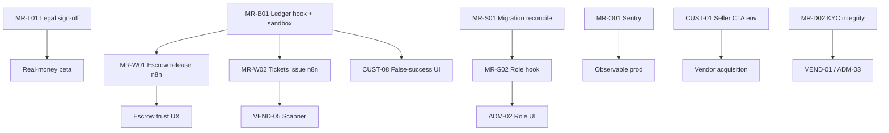

# 24-Hour Workboard — Parallel Panel Execution

> **Superseded for sequencing (2026-07-18 post-implementation refresh).**  
> Use **`implementation-wave-plan.md`** as the authoritative wave plan.  
> Panel PRs #289/#290/#291, prepaid #274, release accounting #294, and KYC #293 are **merged** — do not treat their code work as still missing. Remaining work is staging/production evidence and ops (see wave plan Waves A–E).  
> This workboard is retained as historical session context only.

**Date:** 2026-07-18  
**Goal:** Maximize P0/P1 closure readiness for Cursor coding sessions without production writes from audit agents.  
**Branches:** Three independent panel branches + one integration/release branch.  
**Suffix (this cloud run):** `-8f02`

Effort scale: **S** ≤2h · **M** 2–4h · **L** 4–8h (technical effort, not calendar estimates).

---

## Branch map

| Branch                            | Owner focus                                                       | Exclusive write paths (approx.)                                                                                     | Consumes                                   |
| --------------------------------- | ----------------------------------------------------------------- | ------------------------------------------------------------------------------------------------------------------- | ------------------------------------------ |
| `cursor/panel-customer-8f02`      | Customer UX/routes/PWA/copy                                       | `apps/customer/**`, customer-only i18n keys                                                                         | API contracts as-is                        |
| `cursor/panel-vendor-8f02`        | Vendor UX/KYC/scanner/listings                                    | `apps/vendor/**`, vendor i18n                                                                                       | API contracts; waits on schema for Class D |
| `cursor/panel-admin-8f02`         | Admin RBAC UI/moderation/analytics empty-states                   | `apps/admin/**`, admin i18n                                                                                         | Role API; Access                           |
| `cursor/integration-release-8f02` | Payments ledger, migrations plan, n8n, CI, Sentry, release ledger | `services/api/**`, `supabase/migrations/**`, `infra/n8n/**`, `.github/workflows/**`, `docs/production-readiness/**` | Founder env/legal                          |

**Conflict rule:** Panels do not edit `services/api` payment/ledger core or n8n JSON. Integration does not drive customer marketing copy. Shared `packages/*` changes require integration coordination PR first.

---

## Dependency order (global)



---

## Integration / release board (`cursor/integration-release-8f02`)

| Seq  | Task                                                                              | MR / ID          | Effort | Depends                     | Verification command / test                                                                             |
| ---- | --------------------------------------------------------------------------------- | ---------------- | ------ | --------------------------- | ------------------------------------------------------------------------------------------------------- |
| I-00 | Create release evidence ledger stub + link gates                                  | release-gates.md | S      | —                           | File exists under `consolidated/`                                                                       |
| I-01 | Trace prepaid success → ledger; implement missing `post_transaction` if confirmed | MR-B01           | L      | Lenco sandbox creds         | `cd services/api && uv run pytest -q -k 'ledger or prepaid or escrow'`; sandbox MoMo+card SQL counts >0 |
| I-02 | Failure-path: webhook replay + double-post prevention                             | MR-B01 / G3      | M      | I-01                        | Pytest idempotency; replay produces single txn                                                          |
| I-03 | Import/activate n8n `release-job` (+ order-jobs as designed) with internal token  | MR-W01           | M      | I-01                        | n8n active; dry-run tick 200; sandbox release no double-pay                                             |
| I-04 | Import/activate `tickets-issue` (+ event-release)                                 | MR-W02           | M      | I-01                        | Paid ticket → exactly one ticket; QR horizon OK                                                         |
| I-05 | DBA plan: reconcile `0052` key + apply `0051/0053–0055` **after backup proof**    | MR-S01           | L      | I-08 backup first           | `schema_migrations` matches target; object checks                                                       |
| I-06 | Enable Auth custom access token hook (if applying 0051)                           | MR-S02           | S      | I-05                        | JWT contains role claim; isolation test                                                                 |
| I-07 | FORCE RLS investigation on ticket tier tables                                     | MR-R01           | M      | Security review             | `relforcerowsecurity=true` or signed exception                                                          |
| I-08 | Backup job + restore drill evidence                                               | MR-W04 / G7      | M      | OCI access                  | Artifact date + restore doc PASS                                                                        |
| I-09 | Create Sentry projects + wire DSN **names**; fire test events                     | MR-O01 / G6      | M      | Sentry org                  | Event visible per app                                                                                   |
| I-10 | Make `secret-scan` blocking; align `docs/ops/ci.md`                               | MR-R05 / G8      | S      | GitHub admin for protection | `rg continue-on-error .github/workflows`; CI red on secret                                              |
| I-11 | Record API image digest + frontend SHAs in release ledger                         | MR-B10 / G9      | S      | Host/GHCR                   | Digest ≠ unknown                                                                                        |
| I-12 | Zamtel: confirm F9a; keep flag off; ensure API/checkout methods gated             | MR-L04           | S      | Founder                     | Flag false ⇒ method hidden                                                                              |
| I-13 | KYC: server-side forbid tier>0 without `kyc_records` (guarded transition)         | MR-D02           | M      | —                           | Attempt illegal tier → reject + audit_log                                                               |
| I-14 | Organiser Tier-1 GMV cap implement/verify                                         | MR-B04           | M      | KYC tiers                   | Over-cap sale rejected                                                                                  |
| I-15 | Refund/cancel matrix map + sandbox organiser cancel                               | MR-B03           | L      | I-01                        | Full refund + notify in test                                                                            |

**Integration hour boxing (illustrative sequencing, not calendar ETA)**

1. **Block A (money):** I-01 → I-02 → I-03 → I-04
2. **Block B (ops/safety):** I-08 → I-05 → I-06 → I-07
3. **Block C (observe/CI):** I-09 → I-10 → I-11
4. **Block D (trust):** I-12 → I-13 → I-14 → I-15

---

## Customer board (`cursor/panel-customer-8f02`)

| Seq  | Task                                                          | ID      | Effort | Depends                 | Verification                              |
| ---- | ------------------------------------------------------------- | ------- | ------ | ----------------------- | ----------------------------------------- |
| C-01 | Seller CTA env verify + any fail-closed copy polish           | CUST-01 | S      | Founder sets Vercel env | sell.html probe: no localhost; CTA live   |
| C-02 | Remove/replace superseded logistics/stack claims on marketing | CUST-07 | S      | —                       | Grep pages: no Yango-API/own-fleet/Django |
| C-03 | Add `/[locale]/categories` browse                             | CUST-03 | M      | —                       | HTTP 200; `pnpm --filter customer test`   |
| C-04 | Compare entry from PDP + empty states                         | CUST-04 | M      | —                       | Compare path works; honest empty          |
| C-05 | Fix serwist SW route                                          | CUST-05 | M      | —                       | SW URL 200                                |
| C-06 | Demo disclosure banner / search exclusion UX                  | CUST-02 | M      | Merch decision          | Banner or filtered catalog                |
| C-07 | Payment success UI states (pending/failed/success)            | CUST-08 | M      | I-01 contract           | E2E: no false success                     |
| C-08 | Escrow status copy binding                                    | CUST-09 | S      | I-01/I-03 statuses      | States match API only                     |
| C-09 | Events discovery Phase-1 (feature-flagged if events=0)        | CUST-06 | M      | —                       | Empty-state OK; lenses when data          |

**Customer parallel start:** C-01 (wait env) ∥ C-02 ∥ C-03 — do not wait on ledger for C-02/C-03.

```bash
pnpm --filter customer lint && pnpm --filter customer typecheck && pnpm --filter customer test
curl -sS -m 15 https://www.vergeo5.com/en/health
```

---

## Vendor board (`cursor/panel-vendor-8f02`)

| Seq  | Task                                         | ID      | Effort | Depends               | Verification                            |
| ---- | -------------------------------------------- | ------- | ------ | --------------------- | --------------------------------------- |
| V-01 | Hide/repair verified badge without KYC trail | VEND-01 | M      | I-13 API rule         | Badge absent without records            |
| V-02 | Document + run sandbox KYC upload flow       | VEND-02 | M      | Test vendor + storage | One sandbox KYC completed               |
| V-03 | Listing create UX audit notes → fix blockers | VEND-03 | M      | Test JWT              | Attach path timed; bugs filed           |
| V-04 | Organiser event publish (free RSVP)          | VEND-07 | M      | —                     | Event appears in `/events` beta         |
| V-05 | Offline scanner cache + sync                 | VEND-05 | L      | I-04 tickets          | Offline scan → sync; first-scan-wins    |
| V-06 | Stats/fee UI honesty (no fake GMV)           | VEND-08 | S      | —                     | Empty/zero states; no wireframe numbers |
| V-07 | Evidence photo UI (gated flag)               | VEND-06 | M      | Schema MR-S06         | Reject missing evidence when enabled    |

**Vendor parallel start:** V-01 ∥ V-03 ∥ V-06; V-05 only after I-04.

```bash
pnpm --filter vendor lint && pnpm --filter vendor typecheck
```

---

## Admin board (`cursor/panel-admin-8f02`)

| Seq  | Task                                                           | ID     | Effort | Depends               | Verification                          |
| ---- | -------------------------------------------------------------- | ------ | ------ | --------------------- | ------------------------------------- |
| A-00 | Founder decision capture: single admin vs superadmin/moderator | ADM-01 | S      | Founder               | ADR or decisions row                  |
| A-01 | KYC review UI uses guarded transitions only                    | ADM-03 | M      | I-13                  | Cannot set tier without record        |
| A-02 | Role grant/revoke UI + audit_log                               | ADM-02 | L      | A-00, preferably I-06 | Grant/revoke works; audit row         |
| A-03 | Moderation queue empty-state + staging script docs             | ADM-04 | M      | Access                | Queue renders; merge steps documented |
| A-04 | Analytics empty-state honesty (no fake GMV)                    | ADM-06 | S      | —                     | Zeros labelled; no blueprint fiction  |
| A-05 | Dispatch UI copy matches D16 manual model                      | ADM-07 | S      | —                     | No Yango CTA                          |
| A-06 | Escrow/payout read views bound to ledger                       | ADM-08 | M      | I-01/I-03             | Numbers = ledger or empty             |

**Admin parallel start:** A-00 ∥ A-04 ∥ A-05; A-02 after decision + hook.

```bash
pnpm --filter admin lint && pnpm --filter admin typecheck
curl -sS -m 15 -o /dev/null -w "%{http_code}\n" https://admin.vergeo5.com/en/health
```

---

## Synchronization checkpoints

| Checkpoint | When                   | Required evidence              | Merge rule                         |
| ---------- | ---------------------- | ------------------------------ | ---------------------------------- |
| **Sync-1** | After C-02, V-06, A-04 | No false traction claims in UI | Panels may merge independently     |
| **Sync-2** | After I-01+I-02        | Sandbox ledger fixture         | Unlock C-07, A-06, V-05 prep       |
| **Sync-3** | After I-03+I-04        | n8n execution IDs              | Unlock escrow UX + scanner         |
| **Sync-4** | After I-08+I-05        | Migration + backup proof       | Unlock role hook UI                |
| **Sync-5** | Release candidate      | All P0 gates G0–G9 PASS        | Only then consider real-money beta |

---

## Out of scope for this 24h board

- Seeding 75–100 vendors or fake GMV
- Building Django / Meilisearch / Celery / DPO / Yango
- Flipping `public_launch=true`
- Direct SQL edits to “fix” KYC tiers without migration/state machine
- Implementing Phase-2/3 catalogue (Class C/D/E) unless founder expands scope

---

## Hand-off checklist for coding agents

1. Read `master-reconciliation-register.md` MR-ID for your task.
2. Stay on your branch’s exclusive paths.
3. Open PR titled with panel ID (e.g. `PR-READINESS: CUST-03 categories browse`).
4. Attach verification command output in PR body.
5. Do not mark P0 gates PASS without VERIFIED evidence per `release-gates.md`.
6. Update scorecard change log when a gate flips.

---

## Immediate next actions (first wave)

| Branch      | Start now                                                                                       |
| ----------- | ----------------------------------------------------------------------------------------------- |
| Integration | I-01 ledger trace (sandbox) + I-08 backup proof + I-09 Sentry                                   |
| Customer    | C-02 copy audit + C-03 categories (∥ wait on env for C-01)                                      |
| Vendor      | V-01 badge honesty + V-06 stats honesty + V-03 UX audit                                         |
| Admin       | A-00 RBAC decision ask + A-04/A-05 empty-state/copy                                             |
| Founder     | Set `NEXT_PUBLIC_VENDOR_APP_URL`; legal F4; F9a Zamtel; admin RBAC decision; Access for auditor |

**Release posture after this wave (expected):** still **NO-GO** for real money until Sync-2–5 complete; invite/demo posture improved (honesty + acquisition CTA + observability).
